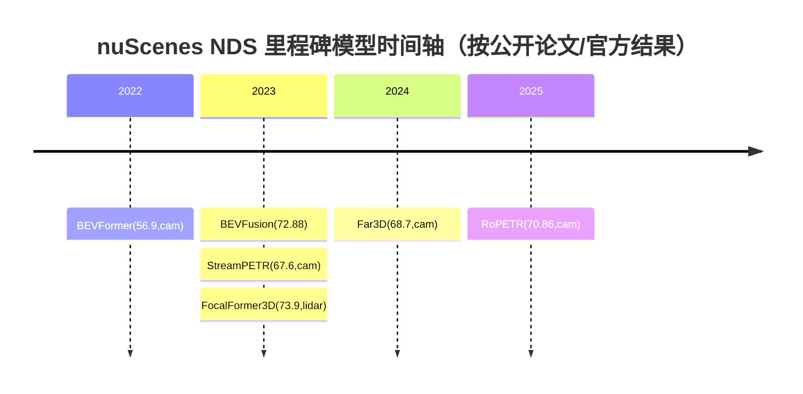
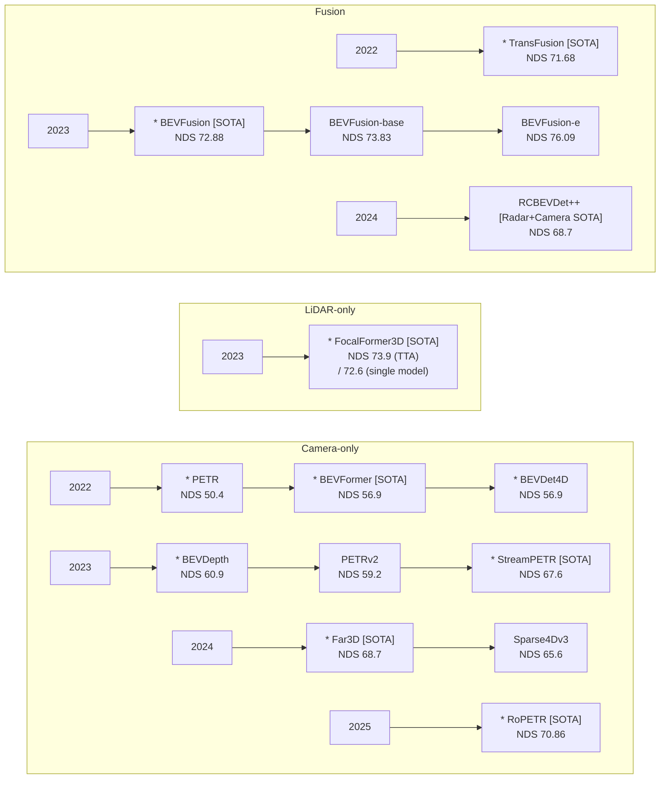

# 平均指标
[[mAP]]
[[NDS]]

GPT深度调研
[[bev perception 2022-2026 deep-research-report]]

```mermaid
timeline
    title nuScenes NDS 里程碑模型时间轴（按公开论文/官方结果）

    2022 : BEVFormer(56.9,cam)

    2023 : BEVFusion(72.88)

         : StreamPETR(67.6,cam)

         : FocalFormer3D(73.9,lidar)

    2024 : Far3D(68.7,cam)

    2025 : RoPETR(70.86,cam)
```

```mermaid
    flowchart LR
  %% =========================
  %% Camera-only
  %% =========================
  subgraph C["Camera-only"]
    direction LR
    C2022["2022"]
    C2023["2023"]
    C2024["2024"]
    C2025["2025"]

    C1["* PETR\nNDS 50.4"]
    C2["* BEVFormer [SOTA]\nNDS 56.9"]
    C3["* BEVDet4D\nNDS 56.9"]
    C4["* BEVDepth\nNDS 60.9"]
    C5["PETRv2\nNDS 59.2"]
    C6["* StreamPETR [SOTA]\nNDS 67.6"]
    C7["* Far3D [SOTA]\nNDS 68.7"]
    C8["Sparse4Dv3\nNDS 65.6"]
    C9["* RoPETR [SOTA]\nNDS 70.86"]

    C2022 --> C1 --> C2 --> C3
    C2023 --> C4 --> C5 --> C6
    C2024 --> C7 --> C8
    C2025 --> C9
  end

  %% =========================
  %% LiDAR-only
  %% =========================
  subgraph L["LiDAR-only"]
    direction LR
    L2023["2023"]

    L1["* FocalFormer3D [SOTA]\nNDS 73.9 (TTA)\n/ 72.6 (single model)"]

    L2023 --> L1
  end

  %% =========================
  %% Fusion
  %% =========================
  subgraph F["Fusion"]
    direction LR
    F2022["2022"]
    F2023["2023"]
    F2024["2024"]

    F1["* TransFusion [SOTA]\nNDS 71.68"]
    F2["* BEVFusion [SOTA]\nNDS 72.88"]
    F3["BEVFusion-base\nNDS 73.83"]
    F4["BEVFusion-e\nNDS 76.09"]
    F5["RCBEVDet++ [Radar+Camera SOTA]\nNDS 68.7"]

    F2022 --> F1
    F2023 --> F2 --> F3 --> F4
    F2024 --> F5
  end
```