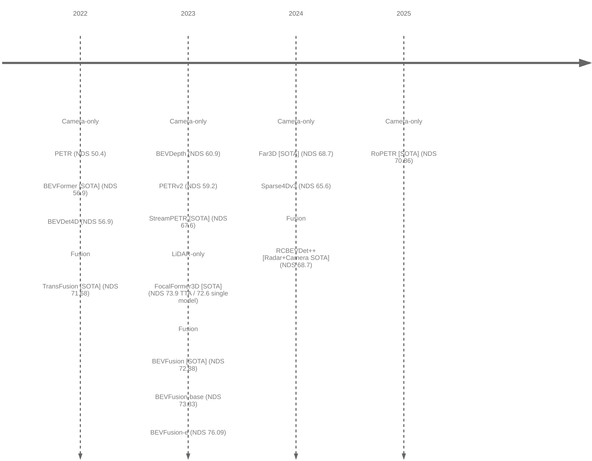

---
categories:
  - "[[Evergreen]]"
created: 2026-04-02
updated:
tags:
  - 0🌲
  - research-note
  - autonomous-driving
  - bev
  - perception
aliases: []
related:
  - "[[mAP]]"
  - "[[NDS]]"
  - "[[bev perception 2022-2026 deep-research-report]]"
---
# 平均指标
[[mAP]]
[[NDS]]

# GPT深度调研
[[bev perception 2022-2026 deep-research-report]]

# BEV 感知代表模型时间轴（按模态分类）

# 📌 2022

### Camera-only

- **PETR**  
    https://arxiv.org/pdf/2203.05625.pdf
- **BEVFormer**  
    https://arxiv.org/pdf/2203.17270.pdf
- **BEVDet4D**  
    https://arxiv.org/pdf/2203.17054.pdf

### Fusion

- **TransFusion**  
    https://arxiv.org/pdf/2203.11496.pdf

---

# 📌 2023

### Camera-only

- **BEVDepth**  
    https://arxiv.org/pdf/2206.10092.pdf
- **PETRv2**  
    https://arxiv.org/pdf/2206.01256.pdf
- **StreamPETR**  
    https://arxiv.org/pdf/2303.11926.pdf

### LiDAR-only

- **FocalFormer3D**  
  https://arxiv.org/pdf/2308.04556

### Fusion

- **BEVFusion**  
    https://arxiv.org/pdf/2205.13542.pdf
- **BEVFusion-base / BEVFusion-e**  
    (same paper as BEVFusion; different configs, no separate arXiv)

---

# 📌 2024

### Camera-only

- **Far3D**  
    https://arxiv.org/pdf/2308.09616.pdf
- **Sparse4Dv3**  
    https://arxiv.org/pdf/2305.14018.pdf

### Fusion

- **RCBEVDet++ (Radar + Camera)**  
    https://arxiv.org/pdf/2403.16440

---

# 📌 2025

### Camera-only

- **RoPETR**  
    https://arxiv.org/pdf/2504.12643.pdf