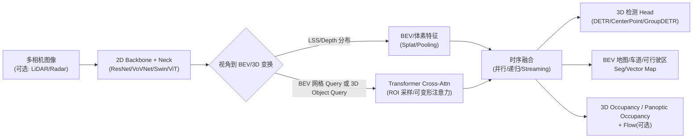

---
categories:
  - "[[Papers]]"
title: bev perception 2022-2026 deep-research-report
authors: []
venue:
year: 2026
doi:
url:
pdf:
field: []
keywords: []
status: to-read
rating:
dataset: []
method: []
task:
created: 2026-04-02
updated:
tags:
  - paper
---

# 自动驾驶 BEV 感知发展现状（2022–2026）

## 执行摘要

自 2022 年以来，Bird’s-Eye-View（BEV）感知在自动驾驶的“统一世界表征”与“可部署性”两条主线驱动下快速演进：一方面，学术界将多相机、多传感器信息从透视视角（PV）映射到自车坐标系的 BEV/体素空间，使检测、车道/可行驶区域、地图要素、占用（occupancy）等任务共享同一空间表征，降低多视角融合与下游规划接口的复杂度；另一方面，产业界将 BEV 作为面向量产与 Robotaxi 的工程“中间层”，强调冗余、多模态、鲁棒性与实时效率。BEV 感知的优势与核心挑战（视角到 BEV 的 3D 信息缺失、标注成本、跨传感器融合、鲁棒与安全）在多篇综述与基准工作中被系统化梳理。

在方法突破上，2022–2023 年形成两大主流路线并持续迭代：  
其一是 **“显式深度 / Lift-Splat-Shoot（LSS）式”** 的 camera→BEV 方案，以 BEVDet4D、BEVDepth、BEVStereo 等为代表，通过深度分布预测与体素/BEV 投影（splat）得到 BEV 特征，并在多帧时序上增强稳定性与速度估计。  
其二是 **“查询（query）驱动 / Transformer 投影（depth-free 或弱 depth）”** 的范式，以 BEVFormer、PETR/StreamPETR、SparseBEV、OPEN 等为代表，通过 BEV 网格查询或 3D 目标查询在多相机特征上做跨注意力聚合，并将时序融合（temporal self-attention / streaming）做成可扩展组件，在 nuScenes 等基准上显著推高 NDS/mAP。

2023–2026 年的第三个显著趋势是 **从“目标级检测”走向“密集占用/场景表征”**：SurroundOcc、TPVFormer、Occ3D、PanoOcc、SelfOcc 等推动 3D occupancy / panoptic occupancy 成为研究热点；同时，面向真实部署的“异常输入”逐步被纳入研究（缺失相机、畸变相机、恶劣天气/遮挡），例如 RoboBEV 的鲁棒评测套件、M²-Occ 的缺失视角协议、FishBEVOD 的鱼眼-针孔混合相机基准。

产业实践方面，公开信息呈现出“**BEV/占用网络 + 多模态冗余 + 自动化数据闭环**”的共同方向：  
- **Tesla** 在 AI Day 2022 公开视频中介绍 Occupancy Network 作为“几何底座层”（base geometry layer），以多相机视频网络预测周围物理占用与运动；相关观点也被研究界在综述中引用并推动“视觉占用预测”热潮。  
- **Baidu Apollo** 开源体系中长期使用“点云 BEV 栅格 + CNN”的 3D 障碍物感知，并进一步开源了基于多相机 BEV Transformer 的 3D 检测 + 占用预测网络（Apollo-Vision-Net），给出了结构、损失与指标提升。  
- **Waymo** 通过官方 Research 页面持续公开感知与数据集论文，并在博客介绍 EMMA 等端到端多模态模型；但其量产级“BEV 中间表征”细节披露有限，更多以论文/基准形式公开。  
- **Cruise、Pony.ai、AutoX、Momenta** 等公司公开资料更多集中于传感器冗余、系统安全与工程流水线（如车载传感器数据处理 pipeline、NOA 产品指标等），对 BEV 感知网络细节披露相对少，需以其安全报告/官方新闻/合作技术博客为主要信息源。

总体挑战集中在六类：深度与尺度不确定性（远距、小目标、遮挡）、长时序一致性与漂移、跨域泛化与标定误差、多模态融合鲁棒性、占用标注/自动标注可信度、以及安全法规对可解释性与验证的要求；这些挑战催生了不确定性建模（GaussianLSS）、对齐鲁棒（GraphBEV）、遮挡补全（CorrBEV）、自监督/少标注（SelfOcc、Self-supervised BEV 预训练）等方向。

## 技术路线与里程碑

BEV 感知可视为“把多源传感器的观测统一到自车坐标系的可计算网格/查询空间”，再用任务头输出检测框、车道/地图要素、占用体素等。nuScenes 等数据集在论文中明确定义了 NDS、mAP 等综合指标，其中 NDS 将 mAP 与多种误差项（平移/尺度/朝向/速度/属性）融合为单一分数，促进了“更像部署”的综合评价。

从时间线看，可归纳为四个阶段（并非严格线性，更多是叠加演进）：

- 2022：**多相机 BEV Transformer 定型**。BEVFormer 用 BEV 网格查询 + 空间跨注意力（按 ROI 采样）+ 时序自注意力实现 camera-only BEV 表征学习，并在 nuScenes test 上报告 56.9% NDS；其官方仓库还给出不同 backbone/尺寸下的 NDS、mAP 与显存需求。  
- 2022–2023：**显式深度（LSS）路线工程化**。BEVDet4D 把时间信息引入 multi-camera 检测并报告 42.1% mAP / 54.5% NDS；BEVDepth/BEVStereo 则强调“可信深度/时序立体”来提升 BEV 构建质量，并在 nuScenes 摄像头检测榜单上给出 50%+ mAP、60% 左右 NDS 的结果。  
- 2023–2024：**稀疏查询与时序流式化**。PETR 体系（PETR、PETRv2、StreamPETR）与 SparseBEV 体系将 3D 查询与时序对齐作为核心，追求更高精度与更低计算；SparseBEV 在论文中报告 nuScenes test 67.5% NDS，并披露 FPS；RecurrentBEV、VideoBEV 等进一步聚焦“长时序融合的效率与性能权衡”。  
- 2023–2026：**从 BEV 到占用/世界模型，并补齐部署鲁棒性**。SurroundOcc、TPVFormer、Occ3D、PanoOcc、SelfOcc 将 3D occupancy/panoptic occupancy 推到主舞台；2025–2026 的 RoboBEV、CorrBEV、M²-Occ、FishBEVOD 将遮挡、传感器失效/缺失、畸变相机等“真实问题”显式化为评测协议与方法设计目标。  

## 代表性论文对比与逐篇解读

### 论文对比表（2022–2026，覆盖检测/分割/占用/融合/鲁棒）

说明：  
- “指标”优先摘录论文摘要、官方代码仓库或 CVF 开源论文页公开结果；不同论文可能使用 **val/test、是否 TTA、输入分辨率、backbone** 等不同设置，横向比较需谨慎。  
- nuScenes 指标 NDS 定义见数据集论文与 BEVDet 文档说明。  

| 论文（时间/会议）                                                                     | 作者/机构（公开信息）                                                                                                                                                                             | 核心任务                         | 输入→输出（BEV/3D 表示）                                                      | 结构要点（文字版）                                                                                                                 | 训练与监督要点                                                                       | 关键创新点                                                         | 公开指标（主要数据集）                                                                                                                 | 速度/规模（若披露）                                                         | 代码/模型                                                                                               |
| ----------------------------------------------------------------------------- | --------------------------------------------------------------------------------------------------------------------------------------------------------------------------------------- | ---------------------------- | --------------------------------------------------------------------- | ------------------------------------------------------------------------------------------------------------------------- | ----------------------------------------------------------------------------- | ------------------------------------------------------------- | --------------------------------------------------------------------------------------------------------------------------- | ------------------------------------------------------------------ | --------------------------------------------------------------------------------------------------- |
| BEVFormer（2022, ECCV）                           | Zhiqi Li 等；（OpenDriveLab相关开源）                                     | 检测、BEV 地图分割                  | 多相机→BEV 网格特征→3D 框/BEV mask                                            | BEV 网格 query；空间 cross-attn（ROI）；时序 self-attn 递归融合                                                                         | 常见做法：map 扩展数据；多配置给出显存/训练周期                                                    | 统一 BEV 表征 + 空时 Transformer                                    | nuScenes test：56.9% NDS；repo 亦给出 val：NDS 51.7 / mAP 41.6（base）                                | repo 给出显存需求与多配置 NDS/mAP                          | `https://github.com/fundamentalvision/BEVFormer`                                  |
| PETR（2022, ECCV）                                            | Yingfei Liu 等；MEGVII研究团队                                             | 检测                           | 多相机→3D position-aware 特征→DETR 式 3D 框                                  | 3D 位置编码注入图像特征；object query 端到端预测                                                                                          | repo 显式给出多个配置与 mAP/NDS                                                        | “位置嵌入变换”让 query 感知 3D 位置                                      | nuScenes：50.4% NDS / 44.1% mAP（repo 新闻）                                                                   | —                                                                  | `https://github.com/megvii-research/PETR`                                         |
| PETRv2（2022→2023, 框架扩展）                                     | 同上                                                                                                                                                                    | 检测 + BEV 分割（并扩展到车道等）         | 多相机（多帧）→对齐后的 3D PE→检测/分割 queries                                      | 引入 temporal modeling；feature-guided position encoder；seg queries 做 BEV patch 分割                                           | 提到 DDAD15M 等预训练权重与多帧对齐数据准备                                  | 统一 3D 感知框架：检测+分割+时序                                           | repo 报告多种配置（如 59% NDS、50% mAP 级别）                                                                         | —                                                                  | `https://github.com/megvii-research/PETR`                                         |
| StreamPETR（2023, ICCV）                         | 同上                                                                                                                                                                    | 检测（流式多帧）                     | 多相机视频→streaming 3D queries→3D 框                                       | “streaming”思路：不依赖未来帧；时序对齐靠 3D PE                                                                                          | repo 给出轻量配置 FPS；paper 摘要强调更高 NDS 与 tracking 指标 | 在不引入未来帧的前提下提升时序性能                                             | repo 示例（r50-704×256）：45.0% mAP / 55.0% NDS、31.7/s                                                         | 31.7/s（PyTorch）                                  | `https://github.com/megvii-research/PETR`（同仓）                                     |
| BEVDet / BEVDet4D（2022, 技术报告/系列）           | BEVDet 系列开源实现                                                                                                                                                       | 检测                           | 多相机→LSS 式 BEV 特征→3D 框                                                 | depth 分布 + BEV pooling；4D 引入时序 cue                                                                                        | 强调图像/BEV 级增强与时序                            | 在较低开销下利用时序提升 NDS/mAP                                          | BEVDet4D-Base：42.1% mAP / 54.5% NDS（论文）；Tiny 配置：mAP 33.8 / NDS 47.6、15.5 FPS（repo） | repo 给出 FPS（~15.5）                             | `https://github.com/Egozjuer/BEVDet`                                            |
| BEVDepth（2022→2023）                         | MEGVII 体系开源                                                                                                                                          | 检测                           | 多相机→深度分布→BEV 特征→3D 框                                                  | “可信深度”提升 view transform 质量                                                                                                | 在榜单提交设置下报告 test 指标（含 TTA）                                | 强化深度监督以提升定位（mATE 等）                      | nuScenes test（榜单提交）：50.3% mAP / 60.0% NDS                                                              | —                                                                  | `https://github.com/Megvii-BaseDetection/BEVDepth`                              |
| BEVStereo（2022→2023, AAAI）                   | 同上                                                                                                                                                                   | 检测                           | 多相机（含时序立体）→深度增强→BEV→3D 框                                              | temporal stereo 增强深度估计；再做 BEV 构建                                                                                          | —                                                                             | 用时序立体缓解深度歧义                                                   | 论文摘要报告：52.5% mAP / 61.0% NDS（nuScenes）                                                                   | —                                                                  | `https://github.com/Megvii-BaseDetection/BEVStereo`                             |
| SOLOFusion（2023, ICLR）                      | Carnegie Mellon University + University of California, Berkeley作者团队 | 检测                           | 多相机视频→长短期 stereo→BEV→3D 框                                             | 结合短期高分辨率与长期低分辨率时序 stereo                                                                                                  | —                                                                             | 从“时间差—分辨率权衡”出发设计强基线                                           | nuScenes camera-only：54.0% mAP / 61.9% NDS（repo 新闻）                                                     | —                                                                  | `https://github.com/divadi/solofusion`                                          |
| SparseBEV（2023, ICCV）                       | Haitong Liu 等                                                                                                        | 检测                           | 多相机视频→稀疏 3D queries（BEV+image）→3D 框                                   | scale-adaptive attention；adaptive spatio-temporal sampling                                                                | —                                                                             | 纯稀疏检测达到接近/超过 dense BEV 的精度，并披露 FPS                            | nuScenes test：67.5% NDS；推理 23.5 FPS（摘要）                                                                 | 23.5 FPS（论文摘要）                                 | `https://github.com/MCG-NJU/SparseBEV`                                          |
| BEV-SAN（2023, CVPR）                         | Xiaowei Chi 等                                                                                                          | 检测                           | 多相机→沿高度采样的 BEV slices→融合→3D 框                                         | “slice attention”：显式强调不同高度信息；LiDAR 引导 slice 采样                                                        | LiDAR 统计分布用于确定 informative heights                                            | 解决 BEV height flattening 信息不足问题                               | 论文与 CVPR 公开版详述（数值需查表）                                                                     | —                                                                  | （论文称将开源）                                                                        |
| BEVFusion（2022, NeurIPS）                    | Tingting Liang 等                                                                                             | 多模态 3D 检测                    | LiDAR+Camera→各自 BEV→动态融合→3D 框                                         | “camera 分支不依赖 LiDAR 输入”的解耦；Dynamic Fusion Module                                                                          | —                                                                             | 解耦相机流对 LiDAR 的依赖以提升部署性                                        | NeurIPS 论文给出对 PointPillars/CenterPoint/TransFusion 等增益示例                                                | —                                                                  | arXiv：`https://arxiv.org/abs/2205.13790`                                        |
| BEVFusion（2023, ICRA）                         | Zhijian Liu 等；MIT 团队                                                                                | 多任务多传感器（检测+BEV map seg 等）    | Camera+LiDAR→共享 BEV→多任务 head                                          | 关键是高效 BEV pooling，将 view transform 延迟降低 40x 量级（论文摘要）                                                  | 兼容多任务训练                                                                       | 统一表征保留几何+语义密度；有部署支持                                           | repo 报告：Waymo test mAP-L1 82.72/ mAPH-L1 81.35 等；nuScenes test NDS 76.09（BEVFusion-e）                     | NVIDIA TensorRT 方案：Jetson Orin 25 FPS（repo News） | `https://github.com/mit-han-lab/bevfusion`                                        |
| SurroundOcc（2023, ICCV）                         | Yi Wei 等                                                                                                             | 3D Occupancy                 | 多相机→3D volume occupancy（体素）                                           | 2D-3D spatial attention lift；3D 卷积逐级上采样；多层监督                                                            | 用多帧 LiDAR + Poisson 重建生成稠密 occupancy GT（免额外人工占用标注）          | 稠密标注生成 pipeline + 体素占用预测                                      | nuScenes、SemanticKITTI 上有效（摘要未列数值）                                                                        | 训练约 2.5 天/8×3090（repo）                           | `https://github.com/weiyithu/SurroundOcc`                             |
| TPVFormer（2023, CVPR）                           | Yuanhui Huang 等；Tsinghua University                                       | 语义占用、LiDAR seg、SSC           | 多相机→Tri-Perspective View（BEV+两垂直平面）→占用语义体素                            | TPV 表示：每点由三平面投影特征求和；TPVFormer 用 cross-attn lift + cross-view hybrid-attn 融合                 | 仅用稀疏 LiDAR 语义点监督训练（强调标注友好）                      | 用 TPV 克服单 BEV 平面难以表达垂直结构的问题                                   | repo 提供训练/推理时间与与 Tesla 方案对比（但未在 README 给出 mIoU 表格）                                                        | 推理时间示例：单 A100 ~290ms（repo 对比表）                   | `https://github.com/wzzheng/TPVFormer`                                            |
| Occ3D（2023, NeurIPS D&B）     | Xingcheng Tian 等；Tsinghua-MARS-Lab                           | 3D Occupancy 基准+模型           | 构建 Occ3D-Waymo/Occ3D-nuScenes；提出 CTF-Occ                              | 标签生成：体素稠密化、遮挡推理、图像引导 refinement；CTF-Occ 用 voxel queries cross-attn 聚合多视图 | visibility-aware 标签与评测 mask                | 首批大规模 occupancy 基准之一，推动“可见性/遮挡”进入评测协议                         | 论文给出 Occ3D 多基线对比与 CTF-Occ 表现（详见 NeurIPS 论文表格）                                                           | —                                                                  | `https://tsinghua-mars-lab.github.io/Occ3D/`                                    |
| UniAD（2023, CVPR）                             | Yunpeng Zhang 等（论文团队）                                                                                                           | 统一自动驾驶（含感知/预测/规划）            | 多相机→统一表征（BEV 为核心之一）→多任务输出（含规划轨迹）                                      | “unified” 训练：把感知与规划联合到一个体系                                                                                                | 多任务联合训练与评测                                                 | 将学术 BEV 感知与端到端驾驶范式连接                                          | 论文给出多个任务指标（检测、occupancy/语义、规划等）                                                                          | —                                                                  | `https://arxiv.org/abs/2212.10156`                                               |
| PanoOcc（2024, CVPR）                           | Yue Wang 等                                                                                                              | 3D Panoptic（Occupancy 表示）    | 多相机多帧→voxel queries→统一 occupancy（语义+实例）                               | voxel query 融合多帧/多视图；统一 occupancy 表示承载 panoptic                                           | 提供 loss 权重与分辨率等实现细节（supp）                                  | “统一 occupancy 表示”连接语义与实例                                      | 论文/补充材料提供 nuScenes 3D semantic + panoptic 指标（详见表格）                                          | —                                                                  | CVF：`https://openaccess.thecvf.com/.../Wang_PanoOcc_..._paper.pdf`               |
| SelfOcc（2024, CVPR）                                        | Wenzhao Zheng 等                                                                                                         | 自监督 3D Occupancy             | 多相机→occupancy（免 GT 或弱监督设定）                                            | 自监督信号驱动的 occupancy 学习（论文主旨）                                                                            | 强调无需人工 occupancy GT 的训练范式                                                     | 直指“占用标注昂贵”的瓶颈                                                 | CVPR 论文给出对比与消融（详见表格）                                                                                     | —                                                                  | CVF：`https://openaccess.thecvf.com/.../Zheng_SelfOcc_..._paper.pdf`              |
| CLIP-BEVFormer（2024, CVPR）                   | Yiming Wei 等                                                                                                     | 检测（增强 BEVFormer）             | 多相机→BEVFormer 特征→3D 检测                                                | 将 CLIP 式对比学习融入 BEVFormer（含高效实现）                                                                        | suppl 披露 KV cache 等效率策略                                   | 以对比学习改进 BEV 特征泛化/鲁棒                                           | CVPR 论文与 supp 给出 NDS/mAP 对比（详见表）                                                           | 论文名包含 “Fast” 强调效率                               | CVF：`https://openaccess.thecvf.com/.../Wei_CLIP-BEVFormer_..._paper.pdf`         |
| RecurrentBEV（2024, ECCV）                     | Ming Chang 等                                                                                                       | 检测（长时序融合）                    | 多相机→BEV→递归融合→3D 框                                                     | RNN-style backprop；inner grid transformation                                                                              | 解决递归融合难以吃到长时序梯度/对齐粗糙等问题（论文摘要）                | 长时序融合兼顾效率与性能                                                  | nuScenes：57.4% mAP / 65.1% NDS（摘要）                                                                       | —                                                                  | `https://github.com/lucifer443/RecurrentBEV`                                    |
| OPEN（2024, ECCV）                            | Jinghua Hou 等                                                                                                             | 检测（强调 object-wise depth）     | 多相机→像素深度 + 目标深度编码→DETR decoder→3D 框                                   | Pixel-wise depth encoder + Object-wise depth encoder + Object-wise position embedding   | LiDAR 投影深度监督 + 3D 中心监督（摘要描述）                              | 用“目标级深度/中心深度”弥补像素深度对 DETR 不友好问题                               | nuScenes test：64.4% NDS / 56.7% mAP（摘要）                                                                 | —                                                                  | `https://github.com/AlmoonYsl/OPEN`                                             |
| GraphBEV（2024, ECCV）                       | Ziying Song 等                                                                                                         | 多模态检测（对齐鲁棒）                  | LiDAR+Camera→BEV→检测                                                   | Local Align（graph matching）+ Global Align；对抗标定误差                                                      | —                                                                             | 明确把“标定误差导致的 BEV misalignment”作为核心问题                           | nuScenes val：mAP 70.1%，较 BEVFusion +1.6%；misalignment noise 下 +8.3%（摘要）                                 | —                                                                  | `https://github.com/adept-thu/GraphBEV`                                        |
| CorrBEV（2025, CVPR）                           | Ziteng Xue 等                                                                                                             | 检测（遮挡/鲁棒）                    | 多相机→baseline（BEVFormer/SparseBEV）+ prototypes→更鲁棒的 3D queries         | 引入视觉+语言 prototype；depth-wise correlation 注入先验；随机像素 drop 模拟遮挡；多模态对比损失                                    | 使用 BERT 等生成语言 prototype（论文内描述）                              | 把“遮挡”从平均指标之外拉回核心优化目标                                          | 对 BEVFormer/SparseBEV：提升约 2.6–2.7 mAP、1.6–2.6 NDS（论文）                                                     | —                                                                  | CVF pdf 同页；supp：                                                                |
| GaussianLSS（2025, CVPR）                     | Shu-Wei Lu 等                                                                                                       | BEV 感知（强调深度不确定性）             | 多相机→深度分布（均值+方差）→3D Gaussians→BEV 特征                                   | 回到 LSS 并加入不确定性：把深度分布转为 3D Gaussian 并 rasterize 到 BEV                                    | 强调速度/显存优势与“仅 0.4% IoU 差距”级别的竞争性                           | 用不确定性显式缓解 real-world depth ambiguity                          | CVPR 论文与摘要强调速度 2.5×、显存 0.3×（相对 projection-based）                                          | 速度/显存相对量化                                      | CVF：`https://openaccess.thecvf.com/.../Lu_Toward_Real-world_BEV_..._paper.pdf`  |
| EVT（2025, ICCV）                             | Yongjin Lee 等                                                                                                              | 多模态 3D 检测（高效 view transform） | LiDAR 引导的 camera→BEV + transformer decoder→3D 框                       | ASAP：LiDAR 引导采样点与自适应投影核；改进 query 初始化与更新                                                 | 以几何引导减少 ray-direction misalignment                                            | 论文称 nuScenes test 达到 SOTA 且 real-time（摘要） | “real-time inference speed”（摘要）                                                                         | ICCV pdf：                                      |                                                                                                     |
| CVFusion（2025, ICCV）                       | Hanzhi Zhong 等                                                                                                        | Radar+Camera 3D 检测           | 4D Radar + Camera→BEV proposals→instance-level cross-view fusion→3D 框 | 两阶段：RGIter BEV fusion 生成高召回 proposals；第二阶段融合 point/image/BEV 多视图 instance 特征            | 关注恶劣天气下 radar 的优势                                                             | VoD、TJ4DRadSet：mAP 提升 9.10% 与 3.68%（摘要）   | —                                                                                                                           | `https://github.com/zhzhzhzhzhz/CVFusion`     |                                                                                                     |
| RoboBEV（2023→2025, 基准/TPAMI） | 世界级鲁棒评测套件（30+ BEV 方法评测）                                                                                                                                            | 鲁棒评测（检测/占用/等任务）              | nuScenes 等 →自然 corruption / domain shift →性能曲线                        | 定义多类 corruption（亮暗雾雪、motion blur、camera crash、frame lost 等）                            | 强调“部署常见问题”评测协议                                                                | 把鲁棒从“附加实验”变为主评测                                               | github 与论文报告：评测 30 个 camera BEV + 3 个 camera-LiDAR BEV 算法                                              | —                                                                  | `https://github.com/worldbench/robobev`                                         |
| M²-Occ（2026, arXiv）                                       | Kaixin Lin 等                                                                                                            | Occupancy（缺失相机视角鲁棒）          | 多相机（缺失/掉线）→occupancy                                                  | 缺失视角协议；MMR 用相邻相机重建缺失特征；FMM 用语义 prototype memory bank 保一致性                                             | 以 missing-view 为显式训练/评测设置                                                     | 直面“真实部署视角不完整”                                                 | 缺失后视角：IoU +4.93%；缺 5 视角：IoU +5.01%（nuScenes/SurroundOcc 协议）                                             | —                                                                  | `https://github.com/qixi7up/M2-Occ`                                             |
| FishBEVOD（2026, arXiv）                                    | Xiangzhong Liu 等                                                                                                       | 基准 + 适配策略                    | KITTI-360→nuScenes 格式；针孔+鱼眼混合→BEV 检测                                  | 提供 rectification、畸变感知 VTM（MEI）、polar 表示等适配并比较 BEVFormer/BEVDet/PETR                                   | 以真实鱼眼畸变覆盖“量产常见相机”                                                             | 结论指出 projection-free 架构更抗鱼眼畸变             | 基准工作（详见论文）                                                                                              | —                                                                  | `https://github.com/CesarLiu/FishBEVOD.git`                                     |
| Self-supervised BEV Seg 预训练（2026, arXiv）   | Daniel Busch 等                                                                                                         | BEV 分割（少标注）                  | 多相机→BEVFormer→可微重投影到图像→自监督/伪标签                                        | 两阶段：自监督预训练 + 少量有监督微调；利用 Mask2Former 伪标签与时序一致性损失                                        | 目标是“更少 BEV GT、更少训练步数”                                                         | 以可微重投影把 BEV 学习拉回到图像监督信号                                       | PDF 摘要称：无需 LiDAR/深度 GT，且用 50% BEV GT + 50% steps 仍可超越部分全监督                               | —                                                                  | arXiv：`https://arxiv.org/abs/2602.18066`                                        |

### 逐篇信息卡（按上表条目顺序，压缩版字段）

为满足“逐篇列字段”的可读性，下列信息卡采用固定字段：**任务 / 架构 / 表示 / 训练 / 创新 / 指标 / 效率 / 复现链接**。其中“损失与增强”仅总结论文/仓库显式披露的关键项；若论文未在摘要/仓库显式披露具体损失细节，则标注“未公开细节（需查正文）”。  

**BEVFormer（ECCV 2022）**：作者/机构：Zhiqi Li 等（OpenDriveLab 相关开源）；任务：3D 检测 + BEV 地图分割；架构：BEV 网格 queries + 空间 cross-attn（ROI 采样）+ 时序 self-attn；表示：多相机→统一 BEV 特征→检测框与 BEV mask；训练：仓库提供多配置、训练周期与显存需求（细损失需查正文/配置）；创新：统一 BEV 表征的空时 Transformer 范式；指标：nuScenes test 56.9% NDS；val/base 配置 NDS 51.7 / mAP 41.6；效率：仓库披露显存与多配置；代码：`https://github.com/fundamentalvision/BEVFormer`。  

**PETR（ECCV 2022）**：作者/机构：Yingfei Liu 等（MEGVII）；任务：3D 检测；架构：把 3D 位置编码注入图像特征形成 position-aware features，DETR 式 query 端到端回归框；表示：多相机→3D PE 特征→3D 框；训练：repo 提供 config、训练时长，常见含 grid-mask 等增强（细节见配置）；创新：Position Embedding Transformation；指标：nuScenes 50.4% NDS / 44.1% mAP（repo 新闻）；效率：repo 给出多配置训练时长；代码：`https://github.com/megvii-research/PETR`。  

**PETRv2（框架扩展, ICCV 2023 体系）**：任务：检测 + BEV 分割（并扩展到车道等）；架构：基于 PETR 的 3D PE，加入 temporal modeling 与 feature-guided position encoder，并用 segmentation queries 做 BEV patch 分割；表示：多帧多相机→对齐后的 3D PE→检测/分割输出；训练：repo 提及 DDAD15M 等预训练、两帧/多帧对齐数据准备；创新：统一多任务 3D 感知框架；指标：repo 报告多配置达 58–59% NDS、49–51% mAP 级别；代码：同 PETR 仓。  

**StreamPETR（ICCV 2023）**：任务：流式时序检测；架构：streaming 多帧 query（不依赖未来帧）+ 时序对齐；表示：多相机视频→3D queries→框；训练：repo 给出轻量配置与 FPS；创新：把时序做成“只看历史”的 streaming 推理范式；指标：示例配置 45.0% mAP / 55.0% NDS、31.7/s；代码：同 PETR 仓。  

**BEVDet4D（2022, 技术报告）**：任务：多相机 3D 检测（含时序）；架构：LSS 式 depth distribution + BEV pooling + 时序 cue（4D）；表示：多相机多帧→BEV feature→检测框；训练：强调图像/BEV 增强与时序；创新：在较小推理开销下利用时间信息；指标：BEVDet4D-Base 42.1% mAP / 54.5% NDS；代码：开源实现见 BEVDet 系列仓库。  

**BEVDet / BEVDet4D（Tiny 实现）**：任务：检测；架构：同上但轻量；指标：BEVDet-Tiny mAP 30.8 / NDS 40.4 / 15.6 FPS；BEVDet4D-Tiny mAP 33.8 / NDS 47.6 / 15.5 FPS；代码：`https://github.com/Egozjuer/BEVDet`。  

**BEVDepth（2022→2023）**：任务：检测；架构：LSS 路线 + 强化深度监督；表示：多相机→深度分布→BEV；训练：榜单提交采用 train+val 训练与 TTA（按文中说明）；创新：强调深度质量与定位误差（mATE）改善；指标：nuScenes test（榜单）：50.3% mAP / 60.0% NDS；代码：`https://github.com/Megvii-BaseDetection/BEVDepth`。  

**BEVStereo（AAAI 2023）**：任务：检测；架构：temporal stereo 增强深度后再建 BEV；指标：论文摘要 52.5% mAP / 61.0% NDS；代码：`https://github.com/Megvii-BaseDetection/BEVStereo`。  

**SOLOFusion（ICLR 2023）**：任务：时序多视图 3D 检测；架构：长短期 stereo 结合；训练：未在摘要披露损失细节（需查正文）；创新：从“时间差—分辨率”理论出发建模；指标：nuScenes camera-only 54.0% mAP / 61.9% NDS（repo）；代码：`https://github.com/divadi/solofusion`。  

**SparseBEV（ICCV 2023）**：任务：稀疏 3D 检测；架构：scale-adaptive attention + adaptive spatio-temporal sampling；创新：纯稀疏范式达高 NDS，并披露推理 FPS；指标：nuScenes test 67.5% NDS、23.5 FPS；代码：`https://github.com/MCG-NJU/SparseBEV`。  

**BEV-SAN（CVPR 2023）**：任务：检测；架构：沿高度维采样构建 BEV slices 并 attention 融合，LiDAR 引导 slice 高度；创新：把“高度信息”作为 BEV 特征构建的显式维度；指标：数值需查 CVPR 论文表格；代码：论文称将开源。  

**BEVFusion（NeurIPS 2022）**：任务：LiDAR-camera 3D 检测；架构：相机流不依赖 LiDAR 输入，BEV 空间动态融合；创新：解耦提升真实部署可用性；指标：论文展示对主流 LiDAR 检测器的 mAP 增益；代码：arXiv 链接公开。  

**BEVFusion（ICRA 2023）**：任务：多任务多传感器（检测+BEV map seg）；架构：统一 BEV 表示 + 高效 BEV pooling（降低 view-transform 延迟）；创新：多任务“任务无关”框架 + 部署（TensorRT/DeepStream）生态；指标：repo 报告 Waymo test 与 nuScenes test/val 多项指标；效率：Jetson Orin 25 FPS（TensorRT 方案）；代码：`https://github.com/mit-han-lab/bevfusion`。  

**SurroundOcc（ICCV 2023）**：任务：3D occupancy；架构：2D-3D spatial attention lift + 3D conv upsample；训练：用多帧 LiDAR + Poisson 重建生成稠密 occupancy GT（避免额外占用标注）；创新：把“稠密占用 GT 生成 pipeline”作为关键贡献之一；指标：摘要声明在 nuScenes、SemanticKITTI 有效（未列数值）；效率：repo 披露训练资源；代码：`https://github.com/weiyithu/SurroundOcc`。  

**TPVFormer（CVPR 2023）**：任务：语义占用/SSC/LiDAR seg；表示：TPV（BEV+两垂直平面）；训练：仅用稀疏 LiDAR 语义点监督；创新：用三平面补足单 BEV 的垂直结构表达；效率：repo 给出推理时间与训练数据量对比；代码：`https://github.com/wzzheng/TPVFormer`。  

**Occ3D（NeurIPS 2023, Datasets & Benchmarks）**：任务：占用基准与模型；表示：Occ3D-Waymo/Occ3D-nuScenes + visibility-aware; 模型：CTF-Occ voxel queries cross-attn；创新：系统化 occupancy label 生成与评测协议；指标：详见 NeurIPS 论文；代码与数据：项目页公开。  

**UniAD（CVPR 2023）**：任务：统一感知-预测-规划；表示：以统一中间表征（BEV 为关键之一）连接多任务；训练：多任务联合优化；创新：把 BEV 感知与端到端驾驶训练更紧地耦合；指标：详见 CVPR 论文表格；代码：arXiv 页面公开。  

**PanoOcc（CVPR 2024）**：任务：3D panoptic；表示：统一 occupancy（语义+实例）；架构：voxel queries 融合多帧多视图；训练：supp 给出 loss 权重与分辨率等；创新：用 occupancy 作为 panoptic 的统一载体；指标：详见 CVPR 论文/补充材料；代码：CVF 页面公开。  

**SelfOcc（CVPR 2024）**：任务：自监督 3D occupancy；创新：降低对人工 occupancy GT 的依赖；指标：详见 CVPR 论文；代码：CVF 公开版论文可复核。  

**CLIP-BEVFormer（CVPR 2024）**：任务：增强 BEVFormer 的检测；架构：对比学习 + 工程加速（KV cache 等）；创新：把“表示学习”作为提升 BEVFormer 的关键杠杆；指标：详见 CVPR 论文与 supp；代码：CVF 公开版论文可复核。  

**RecurrentBEV（ECCV 2024）**：任务：检测；架构：递归长时序融合（RNN-style backprop、inner grid transform）；创新：解决递归融合长时序/梯度贡献问题；指标：nuScenes 57.4% mAP / 65.1% NDS；代码：`https://github.com/lucifer443/RecurrentBEV`。  

**OPEN（ECCV 2024）**：任务：检测；架构：PDE+ODE+OPE，把 object-wise depth（3D 中心）注入 decoder；创新：用“目标级深度”改进远距目标与 DETR 兼容性；指标：nuScenes test 64.4% NDS / 56.7% mAP；代码：`https://github.com/AlmoonYsl/OPEN`。  

**GraphBEV（ECCV 2024）**：任务：多模态检测；架构：图匹配对齐（Local）+ 全局对齐（Global）；创新：显式建模标定误差鲁棒；指标：nuScenes val mAP 70.1%（摘要），并报告在 misalignment noise 下显著优势；代码：`https://github.com/adept-thu/GraphBEV`。  

**CorrBEV（CVPR 2025）**：任务：遮挡鲁棒检测；架构：视觉/语言 prototypes + depth-wise correlation 注入 BEV；训练：random pixel drop + multi-modal contrastive loss；创新：以“遮挡（amodal）补全”做 plug-and-play 增强；指标：对 BEVFormer/SparseBEV 的 mAP/NDS 稳定提升；代码：CVPR 开源论文可复核。  

**GaussianLSS（CVPR 2025）**：任务：真实深度不确定性下的 BEV；架构：把深度分布转为 3D Gaussians 构建 BEV；创新：不确定性 + 更快更省显存；指标：摘要报告 2.5× 更快、0.3× 显存，且性能差距很小；代码：CVPR 公开论文可复核。  

**EVT（ICCV 2025）**：任务：高效多模态 3D 检测；架构：LiDAR 引导 view transform（ASAP）+ 改进 transformer decoder；创新：解决 ray-direction misalignment 与计算瓶颈；指标：摘要称 nuScenes test SOTA + real-time；代码：ICCV 公开论文可复核。  

**CVFusion（ICCV 2025）**：任务：4D radar + camera 检测；架构：两阶段 proposals + cross-view instance fusion；创新：让 radar 在 BEV 空间的作用更充分；指标：VoD、TJ4DRadSet mAP 提升 9.10%、3.68%；代码：`https://github.com/zhzhzhzhzhz/CVFusion`。  

**RoboBEV（TPAMI 2025）**：任务：鲁棒评测；创新：把常见 corruption / domain shift 系统化；指标：评测 30+ BEV 方法与 8 类 corruption；代码：`https://github.com/worldbench/robobev`。  

**M²-Occ（arXiv 2026）**：任务：缺失视角下的 occupancy；架构：MMR 特征重建 + FMM prototype memory；创新：面向相机掉线/遮挡的“韧性占用”；指标：多个缺失视角设置 IoU 提升约 5 点；代码：`https://github.com/qixi7up/M2-Occ`。  

**FishBEVOD（arXiv 2026）**：任务：鱼眼/针孔混合相机 BEV 检测基准；创新：把量产常见畸变相机引入真实基准并总结适配策略；结论：projection-free 更鲁棒；代码：`https://github.com/CesarLiu/FishBEVOD.git`。  

**Self-supervised BEV segmentation 预训练（arXiv 2026）**：任务：少标注 BEV 分割；架构：BEVFormer + 可微重投影 + Mask2Former 伪标签 + 时序一致性损失；创新：减少 BEV GT 与训练步数；代码：论文页公开。  

## 企业实践综述

受限于商业保密，企业“量产 BEV 网络结构/训练细节”很少完整公开；因此此部分严格以 **官方安全报告/官方博客/官方开源代码/公司官网新闻** 为主，并明确“公开披露粒度”。

**Tesla：Occupancy Network 与 BEV/占用表征走向量产语境**  
Tesla 在其官方公开视频 “Tesla AI Day 2022” 中介绍 Occupancy Network：将其作为系统的“基础几何层（base geometry layer）”，以多相机视频网络预测周围物理占用及其运动（公开视频与公开转录均可交叉印证）。  
学术侧大量工作在 2023–2026 将 occupancy 作为“更通用的世界建模输出”，并在综述中明确提到 Tesla 相关公开推动了视觉占用预测研究热度。  
与学术方法的异同：Tesla 更强调端上实时、数据闭环与工程可用性（公开视频侧重系统观念与模块关系），而学术界更强调在公开基准（nuScenes/Waymo/SemanticKITTI）上可复现的 mIoU/NDS 提升与标签生成策略。  

**Baidu Apollo：从点云 BEV 工程到多相机 BEV+Occ 开源**  
Apollo 文档中公开了典型“点云→BEV 栅格→CNN”的 3D 障碍物感知流程（每个 BEV cell 统计特征作为 CNN 输入），这是产业界早期 BEV 工程路线的代表性公开资料。  
更关键的是 Apollo 在 GitHub 上开源 Apollo-Vision-Net：以多相机输入，Transformer encoder 生成 BEV 特征，联合输出 3D 检测与 occupancy，并在 README 中公开了结构要点（BEV queries、temporal self-attn、spatial cross-attn）、损失改动（提高 focal loss 权重、引入 affinity/lovasz 等）与对 BEVFormer-tiny 的 mAP、mIoU 提升。  
与学术方法的异同：架构高度贴近 BEVFormer 类 BEV Transformer，但以“可训练可部署”的方式把 occupancy 作为明确多任务 head，并披露了工程层面的加速（低分辨率 encoder + 高分辨率 occ head upsample）。  

**Waymo：论文与基准驱动的公开路线**  
Waymo 官方 Research 页面汇总了大量感知相关论文与数据集工作，并按年份/方向过滤下载（公开披露重心在“研究论文与数据集基准”）。  
Waymo 官方博客介绍 EMMA（端到端多模态模型）等研究，显示产业研究正向“更统一的端到端表征”迈进，但其是否采用 BEV 中间表征并非公开重点（更多以输入输出任务形式披露）。  

**Cruise：安全报告披露的传感器冗余与系统约束**  
Cruise 2022 Safety Report 明确列出其车载传感器包含 LiDAR、Radar、Camera、IMU 等，强调传感器为车辆提供环境上下文并由计算系统处理。  
面向监管沟通的材料也强调多传感器用于感知与分类道路参与者。  
与学术方法的异同：Cruise 公开材料聚焦“系统安全与传感器冗余”，对具体 BEV 网络结构披露较少；学术界则大量公开 BEV 融合/占用网络细节并在基准上量化对比。  

**Pony.ai：工程流水线（数据处理）公开多于网络结构**  
NVIDIA 开发者博客公开介绍了 Pony.ai 的车载传感器数据处理流水线，包含多摄像头、激光雷达、雷达的同步、封装与下游模块处理，并强调效率与安全性。  
Pony.ai 官方社交媒体内容也强调多模态冗余（尤其 radar 在雨天等恶劣条件下的“兜底”价值），但对 BEV 网络细节披露仍有限。  

**Momenta：合作方官网公开“BEV+Transformer+Occupancy”产品路线**  
智己汽车官网新闻稿中直接提到与 Momenta 的联合开发，并披露其智驾路线在 2021 年已实现 OneModel、BEV、Transformer 技术落地，后续计划进入 Occupancy 占用网络应用阶段；同时给出产品侧安全统计指标（如百万公里碰撞事故次数），但未披露网络结构细节。  

**AutoX：公开信息偏硬件/传感器合作**  
公开新闻更多集中于硬件与传感器合作（例如其选择某类“视觉传感器”以增强速度/远距信息），但对 BEV 感知方案算法细节披露较少。  

## 趋势、挑战与未来方向

### 多模态融合进入“可部署鲁棒”阶段

学术界的多模态 BEV 融合已从“把 LiDAR 与 Camera 特征简单放到同一 BEV”发展到“显式处理标定误差、视角缺失、恶劣天气与遮挡”。GraphBEV 直接把“标定误差导致的错位”作为目标并用图匹配做局部/全局对齐；EVT 用 LiDAR 引导 view transform 以降低 ray-direction misalignment；CVFusion/R4Det 则把 radar 纳入 BEV 融合以提升恶劣天气鲁棒性。  

研究空白与建议：  
- 公开基准对“标定漂移、传感器时间同步误差、部分传感器降级”仍不够系统。FishBEVOD 与 M²-Occ 是把“真实相机形态/缺失视角”显式化的开端，但仍需更贴近量产系统的误差模型与评测协议。  
- 工程上建议把“对齐鲁棒”视为一等公民：不仅做特征层对齐，还需要与下游追踪/规划的风险约束联动（例如对不确定性输出做 conservative planning）。  

### BEV 表示从“2D 平面”走向“3D 占用/可微世界建模”

占用表征能刻画任意形状、开放类别、以及 free space/occupied space 的几何一致性，因此成为从检测走向更完整 world model 的关键中间层。SurroundOcc、TPVFormer、Occ3D、PanoOcc、SelfOcc 的共同点是：输出从“少量框”升级为“稠密体素/实例+语义”，并围绕“标注获取”提出不同路径（稠密标签生成、稀疏监督、自监督）。  

研究空白与建议：  
- **占用标签的可信度与一致性验证**仍不足：自动生成标签（或自监督）引入的系统性偏差，如何对安全关键场景（遮挡行人、静态障碍物、异形物体）做可审计验证，是从论文走向量产的关键鸿沟。  
- **占用 flow / 动态场景**（如 ViewFormer/FlowOcc3D 方向）需要与感知-预测边界重新划分：把“运动”留给预测模块，还是让 occupancy 同时输出 flow，将直接影响可训练性与可解释性。  

### 长时序与跨场景泛化成为性能上限的主战场

多帧输入已成为 BEV 方法的标配，但“更长历史”会带来显存与延迟膨胀；因此并行融合、递归融合、流式融合三类方案长期共存。RecurrentBEV 强调递归融合在效率上占优但需解决梯度与对齐问题；StreamPETR/SparseBEV 强调流式/稀疏化；VideoBEV 把长时序融合扩展到检测/地图/跟踪/运动预测等多任务。  

研究空白与建议：  
- 长时序引入的 **时空漂移与累计误差**（尤其在定位噪声、弱纹理、雨雾等条件）仍缺少统一的诊断工具；RoboBEV 的 corruption 套件是迈向“部署鲁棒评测”的代表，但对“长时序漂移”的专项评测仍可加强。  

### 标注与自监督方法从“附加技巧”走向核心范式

占用与 BEV 地图的标注昂贵，推动了：  
- 自监督 occupancy（SelfOcc）  
- 少标注/自监督预训练（例如 2026 年以可微重投影 + Mask2Former 伪标签做 BEV 分割预训练）  
- 无 teacher 或轻 teacher 的自蒸馏（如 FSD-BEV 的“foreground self-distillation”思想）  

研究空白与建议：  
- 需要更严格的“伪标签误差传播”分析：在 BEV/occupancy 中，一次系统性伪标签偏差可能在时序融合中被放大；建议引入不确定性输出与置信度校准（GaussianLSS 是把不确定性显式化的代表），并在评测里加入 calibration 指标。  

### 效率与部署考量从“加速算子”走向“体系化压缩”

工程上，BEV 的瓶颈常在 view transform 与时序缓存。ICRA 版 BEVFusion 披露了通过优化 BEV pooling 将延迟降低 40x 量级并给出 TensorRT 端侧 FPS；2024 年 ECCV 也出现以 token compression 加速 ViT-based 多视角 3D 检测的研究方向（强调“只保留前景 token”）。  

研究空白与建议：  
- 学术论文常以单卡 FPS 报告，但真实量产需要考虑 **端侧算力、功耗、温度降频、带宽、内存碎片** 等。建议在基准中引入“端到端延迟预算”与“关键场景最差延迟”（tail latency）指标，并公开统一测量脚本。  

### 法规与安全相关问题趋于“鲁棒评测 + 可解释输出 + 安全报告”

监管与安全报告更关心：传感器冗余、系统边界条件、失效模式与风险控制。Cruise 安全报告强调其传感器组合（LiDAR/Radar/Camera/IMU 等）与系统处理链路；RoboBEV 等学术工作则把传感器失效（camera crash、frame lost）与天气/光照扰动纳入评测。  

研究空白与建议：  
- BEV/occupancy 输出通常难以直接解释为安全证据。建议把“可解释中间量”（如占用置信度、未知物体/自由空间不确定性、遮挡推断来源）作为标准输出之一，并在规划层引入保守边界。  

## 关键结论与建议

BEV 感知在 2022–2026 年的核心变化可以概括为：  
第一，BEV 从“融合视角”升级为多任务共享的“统一世界坐标中间层”，Transformer query 与 LSS 深度两大路线长期并存并互相借鉴。  
第二，研究重点从 3D 框检测外扩到 occupancy/panoptic occupancy，并围绕“标注可得性、稠密标签生成、自监督”形成方法族群。  
第三，部署导向的鲁棒问题（遮挡、恶劣天气、标定误差、相机缺失/畸变）正在被越来越多论文转化为“评测协议 + 方法设计”的一部分，预示着 BEV 感知从“刷平均分”走向“补齐安全短板”。  

面向未来（2026 以后）的研究与工程建议：  
- 在学术侧，把 **“真实失效模式”**（缺失视角、标定漂移、同步误差、鱼眼畸变）纳入标准基准，形成可复现的系统化评测与 leaderboard，避免仅在平均 NDS/mAP 上优化。  
- 在方法侧，优先投资 **不确定性建模 + 鲁棒融合对齐 + 可解释占用输出** 三件事：它们比纯粹堆大模型更接近安全落地。  
- 在产业侧，公开“有限但关键”的工程指标会极大推动生态成熟：例如端侧延迟分布、在长尾场景（遮挡行人、雨雾逆光、传感器降级）下的失败率与回退策略；当前公开资料多集中于传感器配置与宏观安全统计，算法层面仍存在较大信息鸿沟。
