---
categories:
  - "[[Evergreen]]"
title: e2d deep-research-report
created: 2026-04-03
updated:
tags:
  - 0🌲
  - report
  - deep-research
  - autonomous-driving
  - e2e
  - pnc
sources: []
period:
  start: 2022
  end: "present"
---
规划训练数据，300w clips每个clips 30s
感知bev训练数据，2w小时数据，3000w
标注200w，2个月的时间
256 A800，3天
# 端到端自动驾驶 PNC 方向深度研究（2022—至今）

## 执行摘要

端到端自动驾驶在 2022—至今的 PNC（Planning & Control）方向，核心分化为三条主线：一端式“传感器到轨迹/控制”的闭环驾驶策略（多以 CARLA 为主战场）、二段式“感知/表示→规划”的规划导向端到端（多以 nuScenes open-loop 为主、逐步向闭环/可执行性靠拢）、以及 2023—至今迅速崛起的扩散/生成式规划（以 nuPlan 闭环为主要验证平台）。在学术界公开资料中，nuPlan 的闭环评测与可复现实装（devkit、tuplan_garage 生态）使“规划可执行性、闭环稳定性、可控性（safety/comfort/style）与推理时延”成为新的主导指标体系；相较之下，单纯 open-loop 的 L2/ADE 指标在闭环相关性上受到更强质疑，推动了“闭环基准 + 规划器/控制器一体化”范式（例如将轨迹生成与可执行控制跟踪、车辆模型、以及约束/奖励统一起来）。

扩散/生成式规划方法在 2024—2025 年形成两个代表性形态：其一是“测试时优化（test-time optimize）”路线（代表：Diffusion‑ES），用扩散模型提供高质量轨迹先验，再用黑盒/不可微奖励做进化式搜索，强调 OOD 行为合成能力，但推理成本高、实时性与工程落地压力大；其二是“可引导的扩散规划策略（diffusion policy / guided diffusion planner）”路线（代表：Diffusion Planner），通过结构化扩散建模 + 分类器/代价引导（guidance）在推理时实现安全/舒适/速度等偏好调节，并报告接近实时的推理时间（0.04s 量级）与较强闭环成绩；二者共同指向“多模态决策 + 可控性 + 闭环一致性”的研究主轴。

公开资料的“里程碑模型谱系”上，ST‑P3、UniAD、VAD/VADv2 展示了从 BEV/occupancy/vectorized 表示驱动规划的系统化路线与效率取舍：UniAD 在 nuScenes 上给出更低的规划 L2 与碰撞率（open-loop），VAD 则在同类指标上进一步降低平均误差/碰撞并显著提升推理 FPS（论文给出 4.5 FPS、轻量版 16.8 FPS），显示“向量化场景表示 + 显式规划约束”在工程效率上的竞争力；而 VADv2 通过“规划动作空间离散化成大词表 + 概率分布学习（KL）+ 冲突约束（conflict loss）”把不确定性显式纳入规划输出，在 CARLA Town05 Long 上报告更高 DS/RC/Infraction Score。

产业界方面，公开论文/技术页中 Waymo 在扩散轨迹建模（MotionDiffuser）上披露了较完整的训练细节（TPU 规模、训练步数、可控采样），显示“生成式轨迹与可控约束”已进入实际系统研发视野；而 Tesla、Cruise、Mobileye、Baidu Apollo、Pony.ai 等在“端到端 PNC 细节（损失、数据、算力、FPS）”层面的系统性公开披露相对有限，本报告以学术论文与开源仓库为主完成可核查的信息整理，并对未公开项显式标注“未公开/未指定”。

## 范围与术语

本报告聚焦 2022—至今“端到端自动驾驶”的 PNC 方向（输出为可执行轨迹/控制，或直接在闭环仿真/基准中评测）。按工程形态划分：

- **一段式端到端（One-stage E2E）**：多传感器/多视角输入 → 直接输出轨迹（waypoints）或控制（steer/throttle/brake）。常见以 PID/LQR 等低层跟踪器将 waypoints 转为控制量，或在网络内直接回归控制。代表：TransFuser、InterFuser、PlanT 等。  
- **二段式端到端（Two-stage / factorized E2E）**：输入 → 学习中间表示（BEV/occupancy/vectorized map & agents）→ 规划模块输出轨迹（并常结合占用、碰撞代价或采样器/后处理）。代表：ST‑P3、UniAD、VAD、VADv2 等。  
- **扩散/生成式规划（Diffusion / Generative Planning）**：用扩散模型建模轨迹分布（可联合多车参与者），并通过 guidance 或 test-time 搜索实现偏好/安全/风格控制。代表：Diffusion‑ES、Diffusion Planner；与 MotionDiffuser 等生成式运动预测存在方法学耦合。  

排除范围：涉及“大模型（LLM）/VLA/WAM”等语言‑行动大模型体系与以语言为核心的闭环驾驶方法不在本文主线中（但若某方法将 LLM 仅用于生成奖励/规则，本报告在扩散规划专章中以“可选模块、非核心”形式说明其与 PNC 的接口边界，并优先给出不使用 LLM 时的规划机制与指标）。

为帮助理解不同路线的接口关系，下图给出 PNC 端到端范式的“输入→表示→规划→控制/评测”抽象：

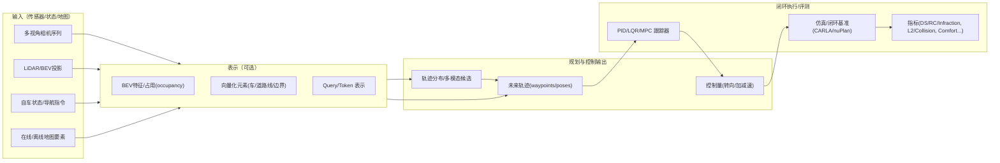

## 基准、指标与可复现性要点

端到端 PNC 在 2022—至今的研究中，**“同一数据集 + 同一协议 + 同一指标”** 远比单一 SOTA 数字更重要；不同论文经常在“是否闭环、是否 reactive agent、是否使用 wrapper/后处理、控制器/车辆模型是否相同”等关键设置上存在差异，因此本报告对每个模型尽量给出“评测协议与结果来源”，并对无法对齐之处显式标注。

### nuScenes：open-loop 规划指标主阵地（但闭环相关性有限）

在规划评测上，UniAD 报告了 nuScenes open-loop 的 **L2(m)** 与 **Collision Rate(%)**（按 1s/2s/3s 与平均）作为规划质量与安全性 proxy；ST‑P3 也在 nuScenes 上报告 L2 与碰撞率，并展示“L2 更小不等价于更安全”的现象（Vanilla L2 最小但碰撞率最大）。

### CARLA：闭环驾驶（DS/RC/Infraction）与“算法‑控制器耦合”问题

CARLA 的闭环指标通常使用 **Driving Score (DS)**、**Route Completion (RC)**、**Infraction Score (IS)**。InterFuser 明确采用 CARLA Leaderboard 的 RC/IS/DS，并在公开 leaderboard（截至 2022 年 6 月）报告排名与分数；VADv2 在 Town05 Long/Short 上也采用官方指标，并说明为公平对比通常使用 rule-based wrapper 抑制违规。

### nuPlan：闭环规划基准（OLS / NR‑CLS / R‑CLS）

nuPlan 被多篇工作用于闭环规划（特别是 Val14 / Test14 / Test14-hard 等子集），并区分 open-loop 分数与闭环分数（non-reactive / reactive agent）。PLUTO 论文给出：训练/评测采用 nuPlan 数据与其闭环仿真框架（15s rollout @10Hz），并强调 open-loop 与闭环相关性弱，因此聚焦闭环；planTF 仓库给出了常用的 OLS、NR‑CLS、R‑CLS 与多基线 time 统计，成为可复现实验的重要入口。

## 里程碑模型详述

本节按统一模板给出 2022—至今主流 PNC 端到端模型/规划器的关键信息；凡论文/官方资料未公开者一律标注“未公开/未指定”。“优先来源”按：论文 > 官方技术报告/博客 > 官方开源仓库 > 第三方。

### 模型卡片：ST‑P3（ECCV 2022，Two-stage vision→BEV→planner）

**架构图（概念化）**（详见论文 Fig.2）

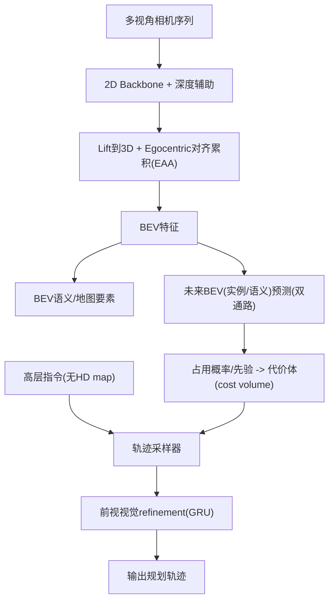

| 字段 | 内容 |
|---|---|
| 输入/输出接口 | 输入：多视角相机视频；输出：感知（BEV 分割/地图）、预测（未来 BEV 分割/实例）、规划轨迹（由采样器 + refinement 得到）。 |
| 损失与训练目标 | 规划部分包含 max-margin 形式的 planning loss + L1 距离项；并结合感知/预测监督。 |
| 训练方法 | 监督学习（多任务），规划采用采样候选与专家轨迹的对比式/间隔式目标（近似 IL + 代价学习）。 |
| 数据集与规模 | nuScenes（open-loop）+ CARLA（闭环仿真）；具体 nuScenes 标注/规模以数据集官方为准（本文不展开标注细节）。 |
| 标注类型 | BEV 分割（drivable area/lane/vehicles/pedestrians 等）、未来分割/实例、专家轨迹。 |
| 训练与部署算力 | 未公开。 |
| 推理 FPS / 延迟 | 未公开。 |
| 部署平台 | 论文以离线评测 + CARLA 闭环为主（部署形态未指定）。 |
| 关键指标与结果 | nuScenes open-loop：L2@1/2/3s=1.33/2.11/2.90m，Collision@1/2/3s=0.23/0.62/1.27%。CARLA Town05：Short DS/RC=55.14/86.74，Long DS/RC=11.45/83.15。 |
| 主要来源 | 论文（ECCV 2022）+ 官方代码仓库（论文内给出）。 |

### 模型卡片：UniAD（CVPR 2023，Planning‑oriented Two-stage E2E）

**架构图（抽象化，按论文 Fig.2 的 query 管线）**

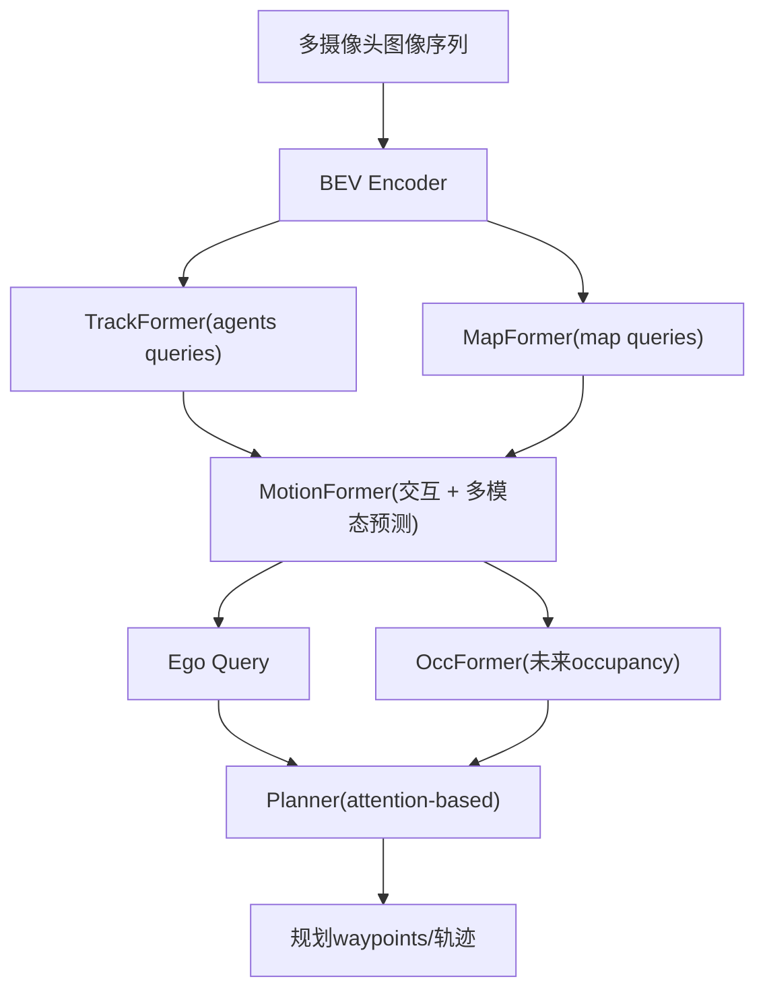

| 字段 | 内容 |
|---|---|
| 输入/输出接口 | 输入：多摄像头图像序列；输出：检测/跟踪、在线地图、运动预测、occupancy、最终 ego 规划轨迹。 |
| 损失与训练目标 | 规划成本函数包含轨迹 L2 与对预测占用的距离惩罚（论文 Eq.(10)(11)）；整体为规划导向的多任务协同。 |
| 训练方法 | 监督多任务学习（planning‑oriented task orchestration）。 |
| 数据集与规模 | nuScenes（论文主评测）。 |
| 标注类型 | 3D 目标/轨迹、地图要素、未来 occupancy、规划轨迹等（由 nuScenes/派生任务提供）。 |
| 训练与部署算力 | 未公开。 |
| 推理 FPS / 延迟 | 论文未直接给出；VAD 论文在对比中给出 UniAD 推理速度 1.8 FPS（硬件/设置未在该段落披露，建议视为同论文对比条件下的相对量）。 |
| 部署平台 | 离线数据集评测（未指定车端）。 |
| 关键指标与结果 | nuScenes planning：L2@1/2/3s=0.48/0.96/1.65m，Avg L2=1.03；Collision@1/2/3s=0.05/0.17/0.71%，Avg=0.31%。 |
| 主要来源 | 论文（CVPR 2023）+ 官方开源仓库。 |

### 模型卡片：VAD（ICCV 2023，Vectorized Two-stage E2E）

**架构图（概念化）**

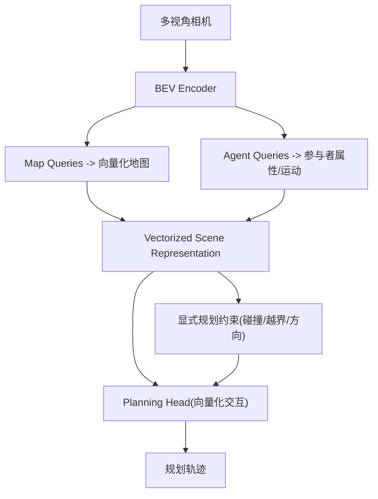

| 字段 | 内容 |
|---|---|
| 输入/输出接口 | 输入：多视角图像；输出：向量化地图/agent 表示与规划轨迹。 |
| 损失与训练目标 | 结合向量化表示学习与规划目标，并引入三类 instance-level 规划约束（碰撞/边界/方向）提升安全。 |
| 训练方法 | 监督学习（端到端多头）。 |
| 数据集与规模 | nuScenes。 |
| 标注类型 | 地图要素、agent 属性与未来轨迹、规划监督等。 |
| 训练与部署算力 | 未公开。 |
| 推理 FPS / 延迟 | VAD‑Base：4.5 FPS；VAD‑Tiny：16.8 FPS（论文给出相对 UniAD 2.5×/9.3× 的速度对比与数值）。 |
| 部署平台 | 论文强调效率与部署潜力，但未披露车端硬件。 |
| 关键指标与结果 | 相对 UniAD：Avg planning displacement error 0.72m（对比 1.03m）、Avg collision 0.22%（对比 0.31%）。 |
| 主要来源 | 论文（ICCV 2023）+ 官方仓库。 |

### 模型卡片：VADv2（arXiv 2024 / ICLR 2026 Poster，Probabilistic Planning Two-stage E2E）

**架构图（按论文 Fig.2 抽象）**

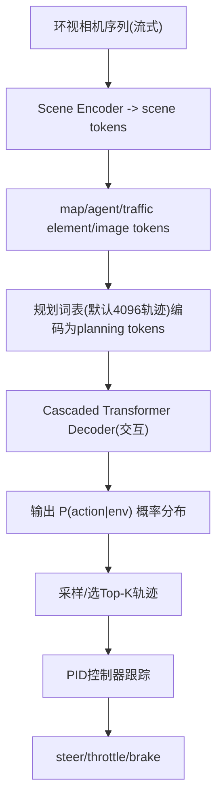

| 字段 | 内容 |
|---|---|
| 输入/输出接口 | 输入：环视相机序列（流式）；输出：规划动作分布（对 4096 轨迹词表的概率）并采样得到可执行轨迹，闭环用 PID 转控制量。 |
| 损失与训练目标 | 三类监督：Distribution loss（KL，使预测分布贴合示教分布）、Conflict loss（将与 agent 未来/道路边界冲突的候选作为强负样本）、Scene token losses（map/agent/traffic element token 的显式监督）。 |
| 训练方法 | 监督/模仿学习为主（从示教数据学习概率规划分布），并用场景约束正则化。 |
| 数据集与规模 | CARLA：用 CARLA 官方 autonomous agent 在 Town03/04/06/07/10 随机路线采集训练数据，2Hz 采样约 300 万帧；评测在未见 Town05（Long/Short）。 |
| 标注类型 | 6 相机图像、交通灯/stop sign、其他参与者信息、自车状态、（训练时）OSM 地图预处理得到的向量地图监督；闭环评测不使用 HD map。 |
| 训练与部署算力 | 未公开。 |
| 推理 FPS / 延迟 | 未公开。 |
| 部署平台 | CARLA 闭环；论文讨论可用 top‑K proposals + rule-based wrapper + optimization-based post-solver 的工程策略（未指定车端）。 |
| 关键指标与结果 | Town05 Long：DS/RC/IS=85.1/98.4/0.87；Town05 Short：DS/RC=89.7/93.0；并给出 open-loop L2/Collision ablation。 |
| 主要来源 | 论文（arXiv 2024；OpenReview 标注为 ICLR 2026 Poster）+ 项目页。 |

### 模型卡片：TransFuser（arXiv 2022 / PAMI 2022，一段式 sensor fusion → waypoints）

**架构图（按论文 Fig.2 抽象）**

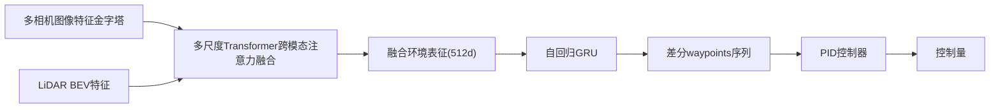

| 字段 | 内容 |
|---|---|
| 输入/输出接口 | 输入：图像 + LiDAR（BEV）等；输出：waypoints（由 PID 转控制）。 |
| 损失与训练目标 | 行为克隆（BC）为主，并引入多任务辅助监督（论文讨论移除辅助任务会显著降低 RC/DS）。 |
| 训练方法 | 监督模仿学习 + 辅助任务多任务训练。 |
| 数据集与规模 | CARLA（包含更具挑战的 Longest6 与 Leaderboard secret routes 设置）。 |
| 标注类型 | 专家示教（轨迹/控制）、辅助任务标注（深度/语义/HD map/车辆检测等，取决于训练配置）。 |
| 训练与部署算力 | 未公开（论文提供了推理 runtime on RTX3090）。 |
| 推理 FPS / 延迟 | 单模型 TransFuser：27.6ms/帧（≈36 FPS）；3 模型 ensemble：59.6ms/帧（≈16.8 FPS），测量包含预处理 + 推理 + PID。 |
| 部署平台 | 仿真闭环；论文声明单模型可在 RTX3090 上实时运行。 |
| 关键指标与结果 | 论文报告在 CARLA Leaderboard 与 Longest6 上显著提升 DS/IS；并给出 runtime 与多种 ablation。 |
| 主要来源 | 论文（PAMI 2022）+ 官方代码仓库（论文内指向）。 |

### 模型卡片：InterFuser（CoRL 2022，一段式“可解释中间量 + 安全控制器”）

**架构图（按论文 Fig.2 抽象）**

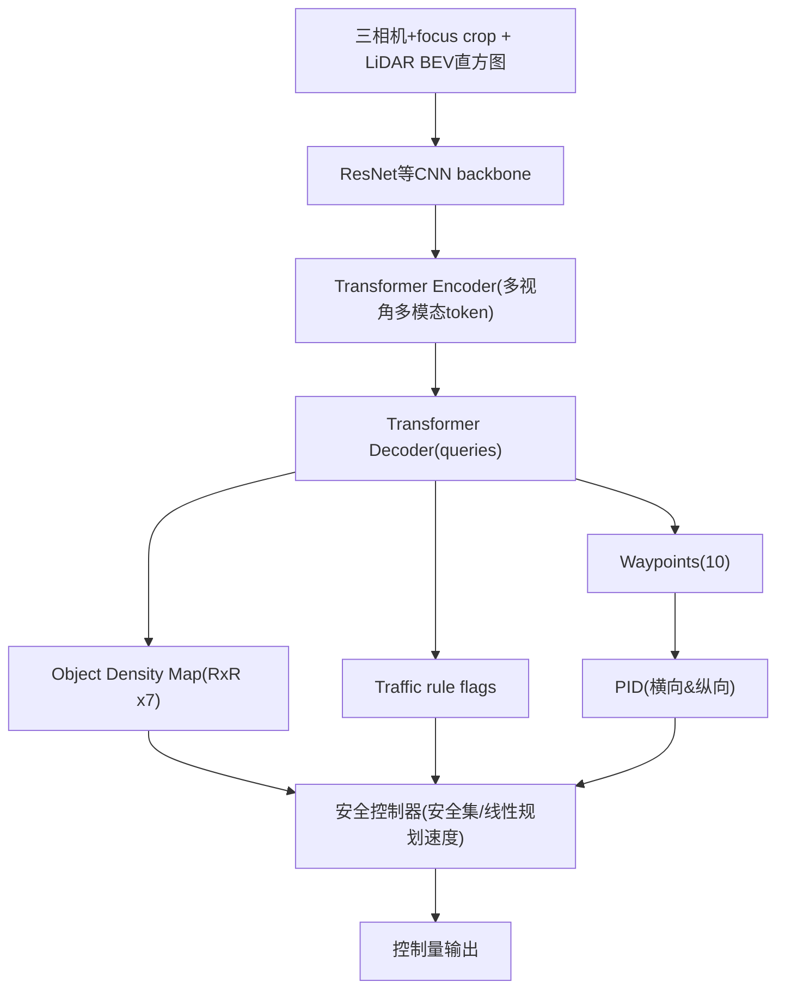

| 字段 | 内容 |
|---|---|
| 输入/输出接口 | 输入：三相机（left/front/right）+ 前视裁剪 focus 图像 + LiDAR BEV 直方图；输出：10 个 waypoint、物体密度图（7 通道）、交通规则信息，并由安全控制器约束低层控制。 |
| 损失与训练目标 | 总损失为 waypoint、density map、traffic rule 三项加权和。 |
| 训练方法 | 监督模仿学习（从 rule-based expert 采集数据），并通过安全控制器在执行时约束。 |
| 数据集与规模 | CARLA：2 FPS 采样，采集 3M 帧（约 410 小时）用于训练与评测。 |
| 标注类型 | 专家驾驶轨迹/控制、交通参与者与信号灯/stop sign 等（CARLA 可获得“特权信息”用于专家与训练）。 |
| 训练与部署算力 | 未公开。 |
| 推理 FPS / 延迟 | 未公开。 |
| 部署平台 | CARLA 闭环与 Leaderboard 评测。 |
| 关键指标与结果 | CARLA public leaderboard（截至 2022-06）：DS/RC/IS=76.18/88.23/0.84，报告排名第 1。 |
| 主要来源 | 论文（CoRL 2022）+ 官方仓库。 |

### 模型卡片：PlanT（CoRL 2022，一段式 object-level planner）

**架构图（概念化）**

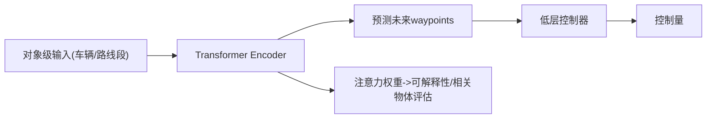

| 字段 | 内容 |
|---|---|
| 输入/输出接口 | 输入：车辆对象集合 + 路线段（object-level scene representation）；输出：未来 waypoints。 |
| 损失与训练目标 | 模仿学习（IL），输出 waypoints 的监督（细节见论文与补充）。 |
| 训练方法 | 监督模仿学习。 |
| 数据集与规模 | CARLA Longest6；论文提到其 3× 数据集约 95 小时驾驶数据。 |
| 标注类型 | 车辆对象状态与 route 监督、专家轨迹。 |
| 训练与部署算力 | 未公开。 |
| 推理 FPS / 延迟 | 论文给出“较同等 pixel-based 规划基线推理快 5.3×”，未给出绝对 FPS。 |
| 部署平台 | CARLA 仿真闭环；并讨论与 off-the-shelf perception 组合。 |
| 关键指标与结果 | Longest6：匹配 expert driving score，且推理更快；并提出可解释性评测协议。 |
| 主要来源 | 论文（CoRL 2022）+ 官方仓库。 |

### 模型卡片：planTF（arXiv 2023 / ICRA 2024，nuPlan 学习型 planner baseline）

| 字段 | 内容 |
|---|---|
| 输入/输出接口 | 输入：nuPlan 场景特征缓存（repo 提供 cache/训练脚本）；输出：规划轨迹并在 nuPlan 闭环执行。 |
| 损失与训练目标 | 基线以模仿学习为主，并提供 state dropout encoder（SDE）等选项。 |
| 训练方法 | 监督/模仿学习。 |
| 数据集与规模 | nuPlan：repo 提供生成 1M frames 训练 cache 的流程；缓存过程作者设置约需 20+ 小时（CPU/RAM 密集）。 |
| 标注类型 | 规划所需的历史轨迹、地图 polyline、交通灯等（nuPlan 数据结构）。 |
| 训练与部署算力 | 训练显存：batch=32 时每 GPU 约 4–6GB（repo 描述），GPU 类型未指定；总训练时间未给出。 |
| 推理 FPS / 延迟 | repo 在 benchmark 表中给出多方法 “Time” 数值（例如 PDM‑Closed=140、PlanTF=155 等；单位在 README 表头未显式说明，通常理解为单步耗时/ms 级别，需以实际脚本日志复核后再作工程承诺）。 |
| 部署平台 | nuPlan devkit 闭环评测。 |
| 关键指标与结果 | repo 给出 Test14/Hard 与 Val14 的 OLS、NR‑CLS、R‑CLS 结果（例如 Val14：PlanTF OLS/NR/R=89.18/84.83/76.78）。 |
| 主要来源 | 官方开源仓库（可复现实验入口）。 |

### 模型卡片：PDM‑Closed（CoRL 2023，nuPlan rule-based / MPC baseline）

| 字段 | 内容 |
|---|---|
| 输入/输出接口 | 输入：nuPlan 场景（地图车道中心线、交通参与者等）；输出：候选轨迹生成 + 打分选择（闭环执行）。 |
| 损失与训练目标 | 非学习型（规则/优化为主）。 |
| 训练方法 | 不适用。 |
| 数据集与规模 | nuPlan 闭环基准（Val14 等）。 |
| 训练与部署算力 | 论文报告 PDM‑Closed 运行时间约 67ms，并讨论其局限（如不执行变道）。 |
| 推理 FPS / 延迟 | 约 67ms（≈15Hz）为论文披露；repo/对比表亦给出其它时间统计（需注意测量口径差异）。 |
| 部署平台 | nuPlan devkit 闭环。 |
| 关键指标与结果 | 多篇后续工作以其作为 nuPlan Val14 强基线并复现（详见对比表）。 |
| 主要来源 | 论文（CoRL 2023）+ nuPlan 生态复现。 |

### 模型卡片：PLUTO（arXiv 2024，nuPlan IL planning SOTA 代表）

**架构图（按论文描述抽象）**

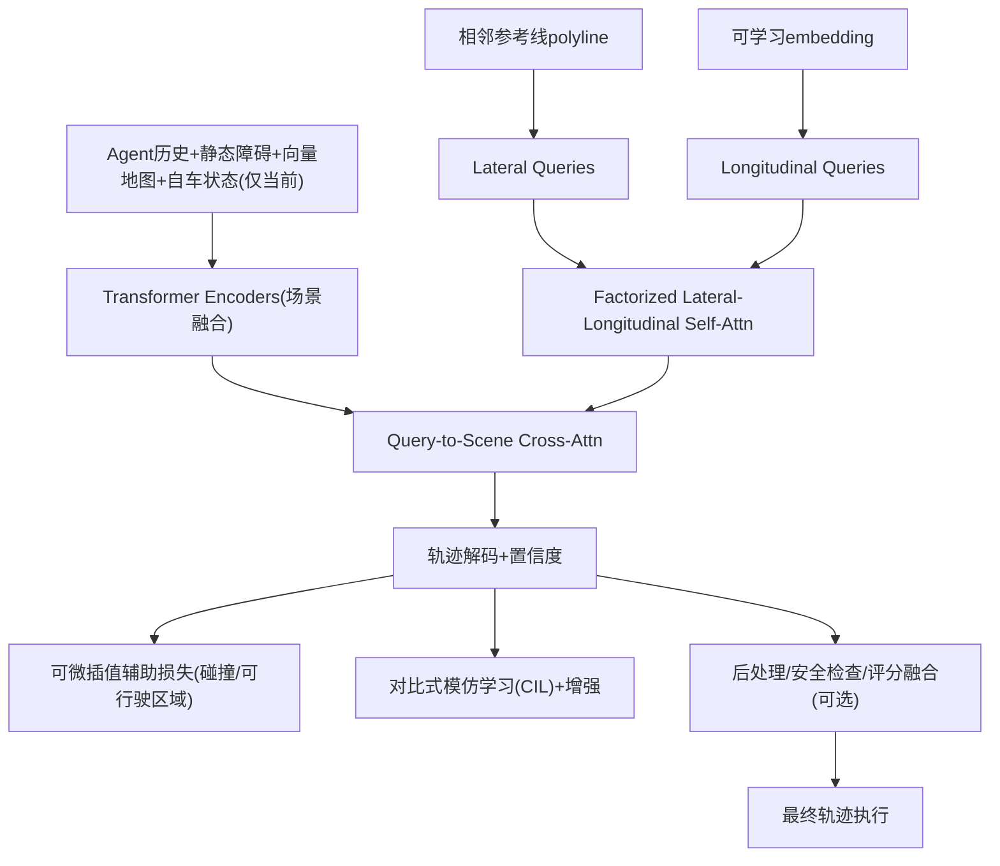

| 字段 | 内容 |
|---|---|
| 输入/输出接口 | 输入：agent 历史（差分向量化）、静态障碍、自车当前状态、polyline 地图与参考线；输出：多模态规划轨迹 + 每轨迹置信度，并可预测其他 agent 轨迹；最终由评分模块选择执行轨迹。 |
| 损失与训练目标 | 模仿损失为主，并引入基于可微插值的辅助损失（惩罚碰撞/越界等）；引入对比式模仿学习（CIL）与一组行为增强以抑制 shortcut、分布漂移与因果混淆。 |
| 训练方法 | 监督/模仿学习 + 辅助损失 + 对比学习（混合）。 |
| 数据集与规模 | nuPlan：论文描述数据约 1,300 小时；训练使用标准 1M frames；评测 Val14（14 类场景、约 1090 scenarios 过滤后）。 |
| 标注类型 | 规划场景要素、历史轨迹与未来轨迹（log）、交通灯等；以 nuPlan 数据结构为准。 |
| 训练与部署算力 | 训练：4×RTX3090，batch=128，25 epochs；训练耗时：无 CIL 约 22h，有 CIL 约 45h。 |
| 成本估算（示例） | 论文 GPU 为 RTX3090（云上按 A100 等价估算仅作示例）：若按 AWS p4d.24xlarge（8×A100）按需 $32.77/h 估算，则 $/GPU‑h≈32.77/8≈$4.10；PLUTO（有 CIL）总 GPU‑h≈4×45=180 GPU‑h，对应约 $737（未含存储/CPU/数据传输；且 A100 与 3090 性能不等，故仅作数量级示例）。 |
| 推理 FPS / 延迟 | 未公开。 |
| 部署平台 | nuPlan 闭环仿真；并提供后处理作为“注入人类偏好/控制”的安全下界。 |
| 关键指标与结果 | Val14（论文表 II）：Pluto(最终版) Score=93.21，Collisions=98.30，TTC=94.04，Drivable=99.72，Comfort=91.93，Progress=93.65，R‑score=92.06；并报告相对 PlanTF、PDM‑Closed 等的提升。 |
| 主要来源 | 论文（arXiv 2024）为主。 |

## 扩散与生成式规划专章（重点）

本节聚焦扩散/生成式规划的“架构、训练目标、采样/控制策略、闭环可控性、算力与延迟、评测结果与局限”。其中 **Diffusion‑ES、Diffusion Planner、PLUTO** 的 nuPlan 闭环指标与实现细节公开度较高，可形成可复现对比。

### Diffusion‑ES（CVPR 2024）：扩散先验 + 进化搜索的黑盒奖励优化

**核心机制**：训练一个（无条件或弱条件）轨迹扩散模型作为轨迹分布先验；测试时用 evolutionary search（population size M=128）在“去噪‑加噪‑截断去噪”空间中迭代突变与选择，以最大化仅在最终去噪轨迹上计算的黑盒奖励；奖励使用 PDM‑Closed 的评分函数变体，并通过 LQR tracker + kinematic bicycle model 把轨迹转执行控制以评估交通规则/碰撞等指标。

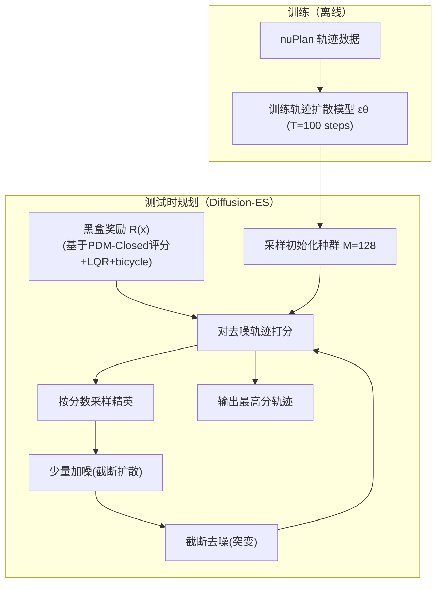

| 关注点 | 公开信息与结论 |
|---|---|
| 输入/输出接口 | 输入：场景特征（文中对比包含无条件扩散与条件扩散策略）、输出：8s 未来轨迹（2D poses / actions 表示），并通过 LQR + bicycle 转控制参与奖励评估。 |
| 训练目标 | 扩散模型训练（轨迹去噪目标），并非直接训练奖励；奖励在测试时用于选择/突变搜索。 |
| 训练方法 | 离线生成式建模（扩散）+ 测试时黑盒优化（进化搜索）。 |
| 数据与标注 | nuPlan（闭环 Val14，reactive track）。 |
| 推理时延与算力 | 论文未给出统一 FPS；对比论文（Diffusion Planner）给出 Diffusion‑ES（带 LLM 的 reward shaping 版本）推理时间约 0.5s（注意这是“扩散规划+搜索”的整体耗时量级提示，不等价于纯轨迹采样）。 |
| 闭环指标 | nuPlan Val14：Driving Score=92，与 PDM‑Closed=92 持平，并显著优于多个 train‑then‑test policy baseline（UrbanDriverOL=65，PlanCNN=72，Diffusion policy=50）。 |
| 局限性（论文显式/可推断） | 方法强调 OOD 行为合成与黑盒目标优化，但核心代价是推理计算量与实时性压力；论文讨论 reward‑gradient guidance 的限制并提出其方法可优化不可微目标。 |

### Diffusion Planner（ICLR 2025 Oral）：结构化扩散规划 + 灵活 guidance 的实时化尝试

Diffusion Planner 将闭环规划重述为“联合生成 ego + 邻车未来轨迹”的扩散生成问题，并引入 classifier guidance 以在推理时调节安全/舒适/速度等偏好；论文报告通过高阶 ODE solver 实现 0.04s 级推理时间，并在 nuPlan 多拆分上给出强闭环成绩；GitHub README 也宣称采样可达 ~20Hz（与 0.04s ≈ 25Hz 同数量级）。

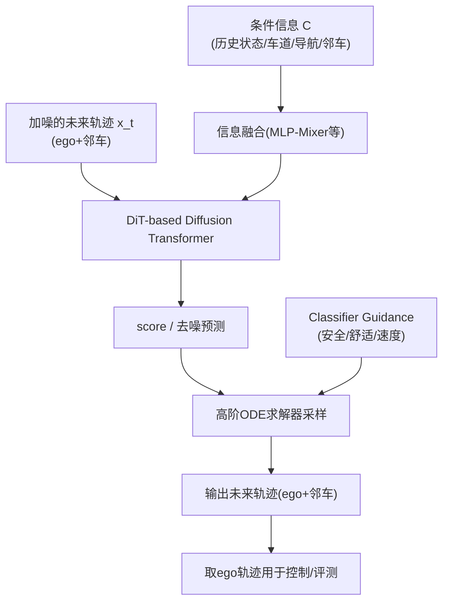

| 关注点 | 公开信息与结论 |
|---|---|
| 输入/输出接口 | 输入为条件信息（车辆状态历史、lane polyline、导航等），输出为多参与者未来轨迹（坐标 + heading 的 sin/cos 形式），下游可接 LQR 控制。 |
| 训练目标 | 以 diffusion loss 联合训练预测与规划（不依赖额外手工 loss 来“拼装”预测‑规划协同）。 |
| 推理策略 | ODE 采样 + classifier guidance；论文给出推理加速点，并讨论 sample efficiency。 |
| 闭环指标（nuPlan） | 表 1 给出 Val14/Test14/Test14-hard 的 NR/R 分数：例如 Val14（ours）NR=89.87、R=82.80；若加 refine（后处理）Val14 NR=94.26、R=92.90。 |
| 推理时间 | 论文附录对“扩散类规划器”对比表中给出 Diffusion Planner inference time 0.04s（Val14 级别）；GitHub README 称约 20Hz。 |
| 局限性 | 论文指出学习型方法在大幅横向机动的数据稀缺问题上仍弱，并提出数据增强、RL 或更强 guidance 作为未来方向。 |

### MotionDiffuser（CVPR 2023，Waymo）：可控扩散多智能体运动预测与“约束采样”接口

虽然 MotionDiffuser 本身是运动预测（prediction）而非直接规划（planning），但它提供了扩散轨迹建模的关键技术部件：**（1）联合多智能体未来分布；（2）仅用单一 L2 训练目标；（3）PCA 压缩轨迹表示以利于计算 exact sample log probability；（4）基于可微代价函数的 constrained sampling 框架**，与扩散规划中的 guidance/约束采样高度同构。

| 字段 | 内容 |
|---|---|
| 输入/输出接口 | 输入：场景上下文与多 agent 历史；输出：多 agent 未来轨迹联合样本，可通过可微 cost 做受控采样。 |
| 损失与训练目标 | 论文摘要强调仅需单一 L2 训练目标。 |
| 训练算力披露 | 补充材料：使用 32 TPU shards、2×10^6 训练步（并给出 AdamW 等超参）。 |
| 数据集与指标 | Waymo Open Motion Dataset（论文称在该数据集上达 SOTA；具体数值需以主论文表格为准，本报告未在同一口径下复抄所有表格数值，故标注为“未指定（见原论文）”。） |
| 主要来源 | CVPR 2023 论文 + Waymo Research 技术页 + 补充材料。 |

### 扩散规划的共同工程问题与可控性总结

- **闭环可控性**：Diffusion‑ES 通过“显式奖励函数 + 搜索”获得强可控性与 OOD 行为合成，但其控制颗粒度与实时性取决于搜索预算；Diffusion Planner 则把可控性以 guidance 的形式嵌入采样过程，强调并行可组合的偏好调节。  
- **时延与算力**：扩散采样天生多步，论文中已出现 ODE solver、（未来可用）consistency/distillation 的明确指向；同时也出现“把搜索结果蒸馏回快速策略”的路线规划。  
- **与传统 PNC 的接口**：Diffusion‑ES 明确采用 LQR tracker + kinematic bicycle model 进行 reward 评估，体现“生成轨迹必须可被车辆模型与跟踪器稳定执行”；这类接口应被视为扩散规划落地的必要组成。  

## 对比表与关键观察

### nuScenes open-loop 规划对比（同协议口径优先采用 UniAD Table 7）

| 方法 | L2@1s (m) | L2@2s | L2@3s | Avg L2 | Collision@1s (%) | @2s | @3s | Avg Col (%) | 推理 FPS | 主要来源 |
|---|---:|---:|---:|---:|---:|---:|---:|---:|---|---|
| ST‑P3 | 1.33 | 2.11 | 2.90 | 2.11 | 0.23 | 0.62 | 1.27 | 0.71 | 未公开 | ST‑P3（论文） |
| UniAD | 0.48 | 0.96 | 1.65 | 1.03 | 0.05 | 0.17 | 0.71 | 0.31 | 1.8 FPS（对比披露） | UniAD Table7 + VAD 对比段落 |
| VAD‑Base | 未公开 | 未公开 | 未公开 | 0.72 | 未公开 | 未公开 | 未公开 | 0.22 | 4.5 FPS | VAD（论文摘要/引言给出 Avg 指标与 FPS） |
| VAD‑Tiny | 未公开 | 未公开 | 未公开 | 0.78 | 未公开 | 未公开 | 未公开 | 0.38 | 16.8 FPS | VAD（论文摘要/引言） |

**观察**：  
1) ST‑P3 在 nuScenes 上展示“L2 最小≠碰撞最小”，并通过代价/采样结构把碰撞率压低；UniAD 则在同表中同时取得更低 L2 与更低平均碰撞率，体现“规划导向的多任务协同（motion + occupancy + planner）”对 open-loop 指标的改进。  
2) VAD 的贡献更偏工程：在保持/提升规划精度与安全（Avg displacement/collision）前提下显著提升推理 FPS，并给出轻量版面向部署的速度‑精度折中。  

### CARLA Town05 Long 闭环对比（同指标 DS/RC/IS）

| 方法 | 模态 | DS ↑ | RC ↑ | IS ↑ | 备注 | 主要来源 |
|---|---|---:|---:|---:|---|---|
| TransFuser | C+L | 31.0 | 47.5 | 0.77 | 端到端 fusion + IL | VADv2 Table1 |
| ST‑P3 | C | 11.5 | 83.2 | 未指定 | 规划 DS 低但 RC 高（论文解释与惩罚有关） | VADv2 Table1 + ST‑P3 Table4 |
| VAD | C | 30.3 | 75.2 | 未指定 | 向量化端到端（非概率） | VADv2 Table1 |
| InterFuser | C | 68.3 | 95.0 | 未指定 | 可解释中间量 + 安全控制 | VADv2 Table1 |
| ThinkTwice | C+L | 70.9 | 95.5 | 0.75 | 解码器可扩展（本报告不展开因未聚焦 LLM） | VADv2 Table1 |
| DriveAdapter+TCP | C+L | 71.9 | 97.3 | 0.74 | teacher‑student + 对齐（细节略） | VADv2 Table1 |
| VADv2 | C | 85.1 | 98.4 | 0.87 | 规划词表 + 概率分布 + 冲突约束 | VADv2 Table1 |

**协议提醒**：VADv2 明确指出闭环评测通常采用 rule-based wrapper 以降低 infractions，并据此进行“公平对比”；因此 DS/IS 的可迁移性高度依赖 wrapper 的定义与实现。

### nuPlan Val14 闭环对比（两组常见口径）

#### 口径一：PLUTO 论文的 Val14 指标体系（Score + 多子项 + R‑score）

| Planner | Score ↑ | Collisions ↑ | TTC ↑ | Drivable ↑ | Comfort ↑ | Progress ↑ | R‑score ↑ | 训练算力 | 推理 FPS/延迟 | 主要来源 |
|---|---:|---:|---:|---:|---:|---:|---:|---|---|---|
| PDM‑Closed | 93.08 | 98.07 | 93.30 | 99.82 | 95.52 | 92.13 | 93.20 | 不适用 | 约 67ms（论文披露） | PLUTO Table II + PDM 时间 |
| PlanTF | 85.30 | 94.13 | 90.73 | 96.79 | 93.67 | 89.83 | 77.07 | 未指定 | 未公开 | PLUTO Table II |
| PlanTF‑H | 89.96 | 97.06 | 93.38 | 97.79 | 91.08 | 92.90 | 88.08 | 未指定 | 未公开 | PLUTO Table II |
| PLUTO（最终） | 93.21 | 98.30 | 94.04 | 99.72 | 91.93 | 93.65 | 92.06 | 4×RTX3090，45h（CIL） | 未公开 | PLUTO Table II + 训练设置 |

#### 口径二：Diffusion Planner 论文的 nuPlan NR/R 分数体系（Val14/Test14/Test14-hard）

| Planner | Val14 NR ↑ | Val14 R ↑ | Test14-hard R ↑ | 推理时间 (s) | 备注 | 主要来源 |
|---|---:|---:|---:|---:|---|---|
| PDM‑Closed | 92.84 | 92.12 | 75.19 | （见其它来源） | 强 rule-based baseline | Diffusion Planner Table1 |
| PlanTF | 84.27 | 76.95 | 61.61 | 未公开 | learning-based baseline | Diffusion Planner Table1 |
| PLUTO（对比复现口径） | 92.88 | 76.88 | 76.88 | 未公开 | 与 PLUTO 原论文口径可能不一致 | Diffusion Planner Table1 |
| Diffusion‑ES（w/ LLM） | 未指定 | 未指定 | 未指定 | 0.5 | 表 4 给出推理时延（含 LLM shaping 版本） | Diffusion Planner Table4 |
| Diffusion Planner | 89.87 | 82.80 | 69.22 | 0.04 | 近实时扩散采样 | Diffusion Planner Table1&4 |
| Diffusion Planner + refine | 94.26 | 92.90 | 82.00 | 未指定 | 加后处理进一步提升 | Diffusion Planner Table1 |

**关键解释**：同为 “Val14” 的 nuPlan 闭环评测，研究社区中存在多种实现与计分口径（例如是否采用特定后处理、是否在 reactive agent track 下评测、是否对场景过滤/初始化失败处理一致）。PLUTO 论文明确过滤若干初始化失败的 reactive 场景，并报告其 Val14 = 1090 scenarios；因此跨论文“同名指标”对比必须带来源与设置。

## 趋势、未解决问题与建议

### 主要技术路线对比

**one‑stage（sensor→traj/control）** 的优势是接口短、端到端闭环容易定义，CARLA 上易形成 DS/RC 的快速迭代；但对真实世界迁移高度依赖数据分布与仿真 fidelity，且很容易把安全性寄托在 wrapper/heuristics 上（例如 creep、emergency stop）。TransFuser/InterFuser 展示了“多模态融合 + 辅助任务/可解释中间量 + 安全控制器”能提升闭环成绩，并且 TransFuser 给出 RTX3090 上 27.6ms 级推理 runtime，为实时性提供了可核查的证据。  

**two‑stage（BEV/occupancy/vectorized→planner）** 的优势在于将“可解释表示与规划”对齐：UniAD 通过规划导向组织 detection/tracking/mapping/motion/occupancy，把 planning 的 L2/collision 压到更低；VAD 则进一步强调向量化表示与显式规划约束带来的效率收益（FPS 显著提升）。这条路线更贴近真实系统“可调试/可回退”的工程需求，但也更容易出现“模块间误差传播、闭环一致性不足”的典型端到端难题。  

**diffusion/generative planners** 代表了“多模态决策+可控性”的新阶段：Diffusion‑ES 以 test‑time 黑盒优化展示了对 arbitrary reward 的适配能力与 nuPlan 强闭环成绩；Diffusion Planner 则在扩散规划中引入 classifier guidance 并报告 0.04s 推理时间与较强闭环得分，指向“生成式规划可实时化”的研究方向。与此同时，MotionDiffuser 在运动预测中对 constrained sampling 与大规模训练披露，为“扩散轨迹模型 + 代价/规则可控采样”提供了通用接口模板。  

### 未解决问题

闭环一致性与评测可信度仍是首要挑战：多篇 nuPlan 工作指出 open-loop 与 closed-loop 相关性弱，且相同 Val14 名称下存在场景过滤、agent 反应模式、后处理等差异，导致结论难以直接迁移；因此“统一可复现协议、公开 evaluator 与运行时统计（ms/FPS）”是提升研究质量的关键。

可证明安全与可控性仍缺少统一工程范式：InterFuser 用可解释密度图与交通规则预测结合安全控制器给出一条路径；Diffusion‑ES/Diffusion Planner 则分别用 reward/guide 把“偏好”显式化。但对于真实系统需要的“可验证安全边界、故障模式覆盖、舒适性（jerk/acc）约束可追责”仍普遍缺乏公开的、可复现实验闭环证明。

算力与数据披露不足限制工程落地：除 PLUTO（明确 4×RTX3090、训练小时数）与 MotionDiffuser（TPU shards 与训练步数）等少数案例外，多数论文对训练算力、推理时延、部署硬件缺乏公开，导致成本/实时性不可评估。

### 面向研究者与工程团队的建议

1) **把“闭环可执行性”作为第一指标**：建议在论文/仓库中默认报告（a）轨迹跟踪器与车辆模型（PID/LQR/MPC；bicycle/动态模型）、（b）单步规划耗时分解（特征构建/推理/后处理/控制）、（c）closed-loop 的 failure taxonomy（碰撞类型、越界、舒适性超限），并对 open-loop 指标仅作为辅助。Diffusion‑ES 的 reward 通过 LQR+bicycle+nuPlan evaluator 计算，是“把执行与评分纳入规划环”的强范例。  

2) **扩散规划建议采用“分层/可蒸馏”的混合架构**：对于 test‑time 搜索类（Diffusion‑ES），建议把搜索得到的高分轨迹分布蒸馏到更快的 reactive policy；对于 guided diffusion（Diffusion Planner），建议系统性探索采样步数‑性能曲线，并用 consistency/distillation 进一步压缩采样步数以满足车端实时性（论文已把它作为未来方向）。  

3) **建立“公开披露标准”并在表格中强制标注未公开项**：推荐至少披露 GPU/TPU 型号、训练步数/epoch、有效 batch、总 GPU‑hours、推理 FPS/延迟测量口径（是否含预处理/后处理/控制）、以及评测协议（reactive/non‑reactive、是否 wrapper、场景过滤规则）。PLUTO 与 MotionDiffuser 的披露粒度证明这一点对复现极其关键。  

### 时间线（2022—至今关键里程碑与公开度）

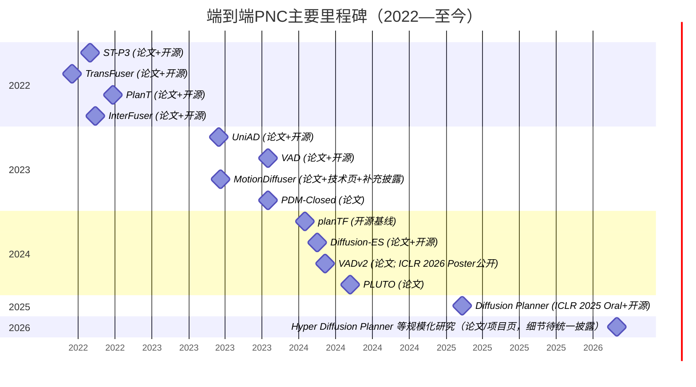

时间线注释：Diffusion Planner 作者/项目页还公开了 Hyper‑Diffusion‑Planner 等后续工作与“真实车辆闭环测试”的宣称，但由于本报告限制在“排除大模型/VLA/WAM”且公开指标尚未形成统一可复现口径，相关细节仅在扩散路线趋势中点到为止。