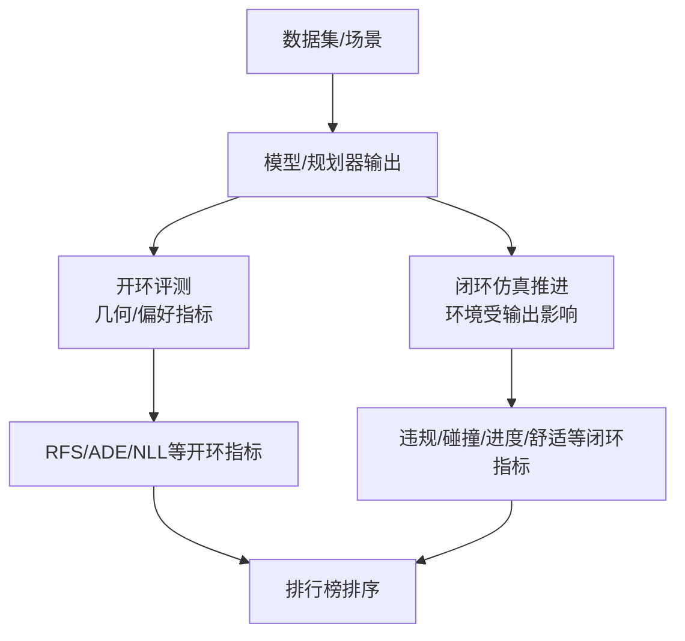

---
categories:
  - "[[Evergreen]]"
title: planner leader board deep-research-report
created: 2026-04-03
updated:
tags:
  - 0🌲
  - report
  - deep-research
  - autonomous-driving
  - planning
  - leaderboard
sources: []
period:
  start: 2022
  end: "present"
---

# 自动驾驶规划 Leaderboards 深度综述

## 执行摘要

（英文表述修正）Please conduct an in-depth study of autonomous-driving planning leaderboards, and write the results in Chinese.

本报告聚焦“规划（planning）”相关的公开榜单与评测体系，并按**评测闭环程度**将其分为三类：  
第一类是**闭环驾驶能力评测**（系统输出会反作用到仿真环境中），典型代表是基于 **CARLA** 的官方 Leaderboard 及其衍生基准 **Bench2Drive**；这类榜单更接近“端到端驾驶/规划控制一体化”的真实难点（违规、碰撞、路线完成等），但通常计算成本高且方差较大（长路线尤其明显）。  
第二类是**闭环/半闭环的真实日志重仿真（log-based simulation）**规划评测，代表是 **nuPlan Planning Challenge**：它明确区分开环模仿与闭环（非交互/可交互）三种模式，并强调多指标综合评价，更贴近真实车辆规划研究的“可复现对比”。  
第三类是**开环规划（open-loop）但更“人类偏好对齐”的轨迹评测**：以 **Waymo Open Dataset** 的两条挑战为代表——**Vision-based End-to-End Driving（WOD-E2E）**用 Rater Feedback Score（RFS）把“人类偏好/安全合理性”纳入主指标；**Sim Agents**则把多智能体闭环仿真视作分布匹配问题，用 Realism Meta 及其分解项评估“交互真实性”。  

受限于部分平台（尤其是 **EvalAI** 公共榜单与部分站点）在当前环境下需要 JavaScript/登录才能完整加载表格，本报告在“排名”部分优先采用**官方挑战页、官方技术报告（Waymo 2025 Technical Reports）、官方主办方公告（Motional/nuPlan）与论文中给出的 leaderboard snapshot**作为可核验来源，并对“无法从页面直接解析到 Top10”的榜单明确标注“未提供/不可见”。  

## 范围、术语与方法

本报告将“自动驾驶规划 leaderboard”定义为：其评测对象是**自车未来轨迹/控制/决策**（可含预测-规划耦合、端到端），并以**驾驶可行性/安全性/舒适性/完成度**等规划指标进行排名；其中仅做“多车轨迹预测”的榜单（如 Argoverse/Lyft L5 预测赛）被归为“规划相关（planning-adjacent）”，因为它们更多评估“预测准确性/多模态覆盖”，而非闭环可驾驶性。  

评测闭环程度的关键差异：  
在 **nuPlan** 的定义中，开环（Open-loop）主要衡量“模仿专家轨迹”的一致性；闭环（Closed-loop）则需要把规划输出送入控制与仿真推进，并用闭环指标评价；进一步，“Reactive agents”会让环境车辆对自车动作做出响应，从而更接近真实交互驾驶。  
在 **Waymo Sim Agents** 中，评测强调“从同一历史条件采样 32 条未来”并用密度估计/似然类指标度量模拟分布与真实数据分布的差异，同时覆盖运动学、交互、地图贴合等维度（含红灯违规等）。  
在 **WOD-E2E** 中，挑战要求预测未来 5 秒 waypoint，并以 RFS 作为主排序指标；相关论文显示 RFS 与 ADE 的相关性并不强，意味着“几何误差小”不一定等价于“更符合人类偏好/更安全合理”。  

本报告的信息抽取遵循：优先官方/一手材料（挑战主页、主办方公告、官方技术报告、论文/技术报告 PDF）；在无法获得榜单完整表格时，使用官方技术报告/论文中的 leaderboard 表格作为“时间截面的最新公开排名”。  

## Leaderboards 对比总览

| Leaderboard（规划相关） | 评测范式 | 主要输出 | 核心指标（排序） | 是否闭环 | 追踪页（URL） |
|---|---|---|---|---|---|
| Bench2Drive（CARLA 衍生） | 仿真闭环驾驶能力 | 驾驶策略/轨迹/控制（端到端或模块化均可） | Driving Score（综合路线完成与违规惩罚） | 是 | `https://huggingface.co/spaces/CarlaLeaderboard/Bench2Drive`  |
| CARLA Autonomous Driving Leaderboard（官方） | 仿真闭环驾驶能力（多 Track） | 端到端/模块化 Agent（Docker 提交） | Driving score、Route completion、Infraction penalty 等列指标 | 是 | `https://leaderboard.carla.org/leaderboard/`  |
| nuPlan Planning Challenge | 开环 + 闭环（非交互/可交互）三模式 | 未来轨迹（基于语义表示与地图元素） | 多指标综合（官方赛制）；论文指出榜单可对 CLS-R/CLS-NR/OLS 取均值综合 | 是（含可交互） | `https://motional.com/news/2023-nuplan-challenge` ；`https://eval.ai/web/challenges/challenge-page/1856/leaderboard/4360/combined_overall_score`  |
| Waymo Sim Agents Challenge（WOD） | 多智能体闭环仿真（分布匹配） | 32 条 joint futures（8s rollouts） | Realism Meta（加权聚合 kinematic/interactive/map 等） | 是（仿真 rollouts） | `https://waymo.com/open/challenges/2025/sim-agents/`  |
| Waymo Vision-based End-to-End Driving Challenge（WOD-E2E） | 开环 waypoint 规划（长尾场景） | 未来 5s waypoint（4Hz） | RFS（主排序），ADE（tie-breaker/辅助） | 否（开环） | `https://waymo.com/open/challenges/2025/e2e-driving/`  |
| CommonRoad（规划基准框架） | 场景/规划问题集 + 提交解排名 | 轨迹/规划解（benchmark solution） | 官方说明“提交解会在 leaderboard 排名” | 依场景而定 | `https://commonroad.in.tum.de/` ；`https://commonroad.in.tum.de/solutions/ranking`（当前环境需 JS） |
| OpenLane-V2 Mapless Driving / Topology（规划相关但偏“拓扑推理”） | 地图/拓扑结构理解（非运动规划主任务） | Driving scene topology / lane segment graph | OLUS/OLS 等综合分（拓扑与结构） | 否（结构任务） | `https://github.com/OpenDriveLab/OpenLane-V2`（指向 opendrivelab leaderboard） |

下面的简化流程图概括不同榜单在“训练数据—推理输出—评价器”上的关键差异（开环 vs 闭环、单车 vs 多智能体、几何误差 vs 人类偏好/违规惩罚）：

## 当前公开排名与条目链接

本节给出“能从公开材料核验”的最新排名快照。若某榜单页面在当前环境无法直接解析到完整表格，则：仍提供追踪 URL，并用官方公告/技术报告/论文中的榜单表格作为替代；同时明确标注 Top10 是否可得。

### Bench2Drive（闭环，CARLA 衍生）

**追踪页（社区汇总）**：`https://huggingface.co/spaces/CarlaLeaderboard/Bench2Drive`；结果文件：`https://huggingface.co/spaces/CarlaLeaderboard/Bench2Drive/blob/main/results.json`。  
**最近更新**：文件历史显示 “Update results.json（约 1 个月前）”，页面未给出精确日期（因此此处只能标注为相对时间）。  
**Top10**：该 results.json 为“论文/条目汇总式 leaderboard”。由于该文件本身并未在可视片段中明确声明排序规则，本报告按其公开展示的 Driving Score 数值给出“当前可见条目中的 Top10（近似）”，并建议读者以追踪页的实时渲染为准。  

| 近似排名 | 条目（模型名） | Driving Score | 论文/报告（URL） | 代码/项目（URL） |
|---|---:|---:|---|---|
| 1 | AlignDrive | 89.07 | `https://openreview.net/forum?id=vhrovHIeE4`  | （未在汇总中给出） |
| 2 | BridgeDrive | 86.87 | `https://arxiv.org/abs/2509.23589`  | （未在汇总中给出） |
| 3 | HiP-AD | 86.77 | `https://arxiv.org/abs/2503.08612`  | `https://github.com/nullmax-vision/hip-ad`  |
| 4 | R2SE | 86.28 | `https://arxiv.org/abs/2506.09800`  | （未在汇总中给出） |
| 5 | SimLingo-Base (CarLLaVA) | 85.94 | `https://arxiv.org/abs/2406.10165`  | `https://github.com/RenzKa/simlingo`  |
| 6 | TransFuser++ | 84.21 | `https://arxiv.org/abs/2306.07957`  | `https://github.com/autonomousvision/carla_garage`  |
| 7 | GaussianFusion | 79.40 | `https://arxiv.org/abs/2506.00034`  | `https://github.com/Say2L/GaussianFusion`  |
| 8 | PGS | 78.08 | `https://openreview.net/forum?id=PZqII8EoFG`  | （未在汇总中给出） |
| 9 | ORION | 77.70 | `https://arxiv.org/abs/2503.19755`  | `https://github.com/xiaomi-mlab/Orion`  |
| 10 | VLR-Driver | 75.01 | `https://openaccess.thecvf.com/.../Kong_VLR-Driver_...pdf`  | （未在汇总中给出） |

> Bench2Drive 本身提出的动机之一，是认为既有端到端方法常用开环指标（如 L2、碰撞率等）不足以反映真实驾驶能力，而 CARLA 长路线（Town05Long/Longest6 等）指标方差大，因此 Bench2Drive 以更细粒度的短路线场景集进行闭环评测。  

### CARLA Autonomous Driving Leaderboard（官方）

**追踪页**：`https://leaderboard.carla.org/leaderboard/`。  
官方页面展示了多 Track（SENSORS/MAP）并列出 Driving score、Route completion、Infraction penalty、各类碰撞/交通规则违规等列指标；评价细节在 “Evaluation” 页面给出。  
**Top10**：该页面在当前环境下未能解析到包含队伍/提交的完整表格行（仅可见表头/说明），因此无法从页面直接抄录 Top10；建议以官方追踪页在可运行浏览器中的显示为准。  

补充：官方文档明确该 Leaderboard 通过容器化（Docker）提交 agent，并在云端评测；同时区分 SENSORS/MAP 及其 qualifier phase。  

### nuPlan Planning Challenge（Motional 主办，规划三模式）

**主办方公告（含排名与条目链接）**：`https://motional.com/news/2023-nuplan-challenge`。  
**官方榜单（EvalAI，当前环境不可直接解析表格）**：`https://eval.ai/web/challenges/challenge-page/1856/leaderboard/4360/combined_overall_score`。  
**最后更新日期**：主办方公告页为 2023-09-06。  

**Top3（来自主办方公告，附条目链接）**：  
- Rank 1：CS_Tu（条目链接：论文/预印本/代码均在公告页给出）`https://opendrivelab.com`（paper） / `https://arxiv.org`（arXiv）/ `https://github.com`（code）  
- Rank 2：autoHorizon（paper 链接在公告页给出）`https://opendrivelab.com`  
- Rank 3：Pegasus（paper 链接在公告页给出）`https://opendrivelab.com`  

> 评测模式定义（开环、闭环非交互、闭环可交互）与开/闭环评分依据（开环对齐专家轨迹；闭环用闭环指标套件）在主办方公告中有明确图示说明。  

### Waymo Open Dataset Sim Agents Challenge（多智能体仿真真实性）

**追踪页**：`https://waymo.com/open/challenges/2025/sim-agents/`。  
挑战要求为每个场景生成 **32 条 8 秒 rollouts**，并将评测视为“分布匹配”，用基于采样密度估计的似然类指标度量 simulated futures 与 logged future 的一致性；指标分为 motion、interaction、map adherence，并以加权平均形成 meta-metric（分数越高越好）。  
**Top10（可核验的 leaderboard snapshot）**：在 2025 技术报告 **TrajTok** 中给出 Top15 表格（以 Realism Meta 为主排序）。  
**最后更新日期**：该快照来自 2025-06 的技术报告/预印本时间点（并非网页实时榜单的保证）。  

| 排名 | 方法 | Realism Meta（↑） | 关键分项（Kinematic / Interactive / Map-based） | minADE（↓） | 来源 |
|---|---|---:|---|---:|---|
| 1 | SMART-R1 | 0.7855 | 0.4940 / 0.8109 / 0.9194 | 1.2990 |  |
| 2 | TrajTok | 0.7852 | 0.4887 / 0.8116 / 0.9207 | 1.3179 |  |
| 3 | unimotion | 0.7851 | 0.4943 / 0.8105 / 0.9187 | 1.3036 |  |
| 4 | SMART-tiny-CLSFT | 0.7846 | 0.4931 / 0.8106 / 0.9177 | 1.3065 |  |
| 5 | SMART-tiny-RLFTSim | 0.7844 | 0.4893 / 0.8128 / 0.9164 | 1.3470 |  |
| 6 | comBOT | 0.7837 | 0.4899 / 0.8102 / 0.9175 | 1.3687 |  |
| 7 | AgentFormer | 0.7836 | 0.4906 / 0.8103 / 0.9167 | 1.3422 |  |
| 8 | UniMM | 0.7829 | 0.4914 / 0.8089 / 0.9161 | 1.2949 |  |
| 9 | R1Sim | 0.7827 | 0.4894 / 0.8105 / 0.9147 | 1.3593 |  |
| 10 | SimFormer | 0.7820 | 0.4920 / 0.8060 / 0.9167 | 1.3221 |  |

同时，CVPR 2025 Workshop on Autonomous Driving（WAD）网页给出了该挑战在当年 workshop 语境下的“First/Second/Third Place”与对应技术报告链接（注意：这更接近“挑战报告/奖项名单”，与后续论文/报告中的“榜单最新快照”可能存在时间差）。  

### Waymo Vision-based End-to-End Driving Challenge（WOD-E2E，长尾开环规划）

**追踪页**：`https://waymo.com/open/challenges/2025/e2e-driving/`。  
任务定义为：给定多相机图像、历史 ego 状态与 routing 信息，预测未来 5 秒 waypoint（4Hz）；按 Rater Feedback Score（RFS）在 3s 与 5s（并跨 11 类场景平均）进行排序，ADE 作为次级指标。  
**Top10**：挑战网页在当前环境未直接展示可抄录的完整榜单表格；但 WOD-E2E 论文提供了若干代表方法的 RFS/ADE 对比（Figure 8），可作为“公开可核验的榜单快照（代表性条目）”。  
**奖项/挑战报告 Top3**：WAD 官方页列出 First/Second/Third Place 及报告链接（Waymo 2025 Technical Reports）。  

代表性条目快照（来自 WOD-E2E 论文 Figure 8；并非完整 Top10）：  
- Poutine：RFS 7.986，ADE 2.741（SFT+RL；Qwen2.5 3B）  
- UniPlan：RFS 7.779，ADE 2.986（SFT；DiffusionDrive 60M）  
- DiffusionLTF：RFS 7.717，ADE 2.977（SFT；DiffusionDrive 60M）  
- HMVLM：RFS 7.736，ADE 3.071（SFT；Qwen2.5 3B）  
- Swin-Trajectory：RFS 7.543，ADE 2.814（SFT；Swin Transformer 36M）  
- AutoVLA：RFS 7.556，ADE 2.958（SFT+RL；Qwen2.5 3B）  
- Baseline（NaiveEMMA / Gemini Nano 系列）：RFS 7.528，ADE 3.018  

## Top-3 模型深度解析

本节对每个榜单的 Top3（或可核验的 Top3）给出“可从一手材料验证”的技术摘要：模型结构、训练数据/方法、损失（如公开）、评测指标与关键实现细节。对未在公开材料中明确的信息，直接标注“未说明”。

### nuPlan Planning Challenge（Top3：CS_Tu / autoHorizon / Pegasus）

**评测与指标框架**：主办方明确三模式（开环、闭环非交互、闭环可交互），并解释开环按“拟合专家轨迹”的开环指标评分，闭环则使用闭环指标套件评价规划器在仿真中的行为。  

**Rank 1：CS_Tu（论文/代码链接在主办方公告中）**  
- 架构要点：方法将“安全舒适轨迹生成”拆为两子任务：（1）短时 motion planning；（2）长时 ego trajectory forecasting。短时更影响闭环表现，长时更关键于开环任务。  
- 训练与数据：公告未给出训练集明细与损失函数；只描述“rule-based predictive planner 提供 proposal + learned ego-forecasting module 做 refinement”。  
- 预测-规划耦合：通过“规则 proposal + 学习 refinement”体现显式耦合（偏混合式）。  
- 开/闭环：面向三种挑战模式（含 reactive closed-loop）。  
- 性能数值：公告页未公开 CLS/OLS 等分项的具体数字，仅给出名次与方法描述。  

**Rank 2：autoHorizon（paper 链接在公告中）**  
- 架构要点： imitation learning；用**时空 heatmap**表征 ego 未来轨迹分布；多任务学习预测/建模周边动态物体；将预测信息用高效卷积构成 collision avoidance map；最终由 post-solver 生成安全舒适可行轨迹。  
- 训练与损失：公告未披露 loss 公式/具体实现细节。  

**Rank 3：Pegasus（paper 链接在公告中）**  
- 架构要点： imitation learning；使用**向量化地图表示** + Transformer encoder/decoder；输出为 **GMM**（高斯混合）且带预定义 initial queries。  
- 实现技巧：后处理采用较低 planning rate 以减轻误差累积；碰撞检测触发及时 replanning。  

> 公开信息缺口：nuPlan Top3 的公告页提供了可核验的高层结构描述与论文链接，但未在该页面直接公开完整训练细节、损失函数细节与分项指标数值；若需要逐项量化对比，通常需回到对应论文/代码与原始 EvalAI 榜单。  

### Waymo Vision-based End-to-End Driving（Top3：UniPlan / DiffusionLTF / Swin-Trajectory）

**评测指标**：挑战页说明以 RFS 为主排序指标，并给出其基于“rater 标注轨迹 + 信任域（trust region）+ 超出信任域指数衰减/下限分”的定义；ADE 作为次级指标。  
**榜单信号特征**：WOD-E2E 论文 Figure 8 展示 RFS 与 ADE 相关性较弱（仅“轻微正相关”），因此“最小 ADE”并不必然对应“最高 RFS”。  

**Rank 1：UniPlan（Waymo 2025 Technical Report）**  
- 架构：报告称其统一框架建立在 DiffusionDrive 之上，并针对 WOD-E2E 进行适配（报告用“Model Architecture”章节说明）。  
- 训练数据：报告描述使用 WOD-E2E 并引入 nuPlan 数据做联合训练的设置对比（Setting C vs A/B），并给出各类场景分项 RFS 与 ADE。  
- 训练方法与超参：AdamW；学习率 3e-4；Warmup+Cosine；100 epochs；4×H100；有效 batch size 256。  
- 推理策略：训练 4 个不同 seed 的模型（含全量与子集），每个模型生成 20 条候选轨迹（2 denoising steps），用 confidence head 打分；收集 80 candidates 选最高分作为输出。  
- 损失函数：报告未在可见页明确写出具体 loss 形式（仅说明建立在 DiffusionDrive 上并进行适配），因此此处标注为“未说明”。  
- 公布性能（代表性）：报告表格给出 Average RFS ≈ 7.685（不同设置略有差异）及 ADE@3s、ADE@5s；WOD-E2E 论文的 Figure 8 给出 UniPlan（RFS 7.779，ADE 2.986）作为代表性条目。  

**Rank 2：DiffusionLTF（Waymo 2025 Technical Report）**  
- 架构：报告提出 Open-X AV（OXAV）用于聚合多数据集，并使用两阶段训练：先在感知导向数据上 pre-train，再在规划导向长尾场景 post-train；参赛模型使用 ResNet34 backbone，并强调“简单端到端策略”。  
- 训练数据：报告列出其 OXAV 初版支持四数据源（含 CARLA、NAVSIM、WOD-Perception、WOD-E2E 等），并说明这些数据在输入输出模态、规模与策划方式上互补。  
- 训练/目标：挑战任务被定义为 open-loop waypoint 预测，并以 RFS 为核心指标；报告直接用于参加 Waymo Vision-based E2E Driving Challenge。  
- 损失函数：报告未在可见页直接给出明确的 loss 公式（更多讨论数据与训练流程），因此标注为“未说明”。  
- 公布性能（代表性）：WOD-E2E 论文 Figure 8 给出 DiffusionLTF（RFS 7.717，ADE 2.977）。  

**Rank 3：Swin-Trajectory（结构信息来自 WOD-E2E 论文）**  
- 架构：WOD-E2E 论文描述其为轻量 MLP-based：用 Swin Transformer 从**三路前向相机**提取图像特征，再用简单 MLP 直接预测 waypoint。  
- 训练/损失：论文在该段未进一步披露损失细节与训练 recipe（“详细报告见其技术报告”），因此标注“未说明”。  
- 公布性能：Figure 8 给出 Swin-Trajectory（RFS 7.543，ADE 2.814，参数量 36M）。  

**补充：Poutine（Special Mention，但公开材料显示其 RFS 更高）**  
- 模型与训练：技术报告称其为 3B 参数 VLM，先做 vision–language–trajectory（VLT）next-token prediction 预训练（CoVLA + WOD-E2E），再用 Group Relative Policy Optimization（GRPO）基于少量偏好标注帧进行 RL post-training。  
- 数据与标注：语言注释由 Qwen2.5-VL 72B Instruct 自动生成；报告强调无需人工标注校验。  
- 指标与成绩：报告给出其在官方 test set 的 RFS=7.99（并在 Figure 1 表述为“ranked first by a considerable margin”），与 WOD-E2E 论文的代表性条目数值（RFS 7.986）一致量级。  

### Waymo Sim Agents（Top3：SMART-R1 / TrajTok / unimotion）

**评测机制与指标分解**：官方挑战页把评价分为 motion、interaction、map adherence 三类特征，并以加权平均形成 meta-metric；同时要求每个场景提交 32 futures。  

**Rank 1：SMART-R1（论文摘要可核验）**  
- 架构与范式：论文将方法描述为面向 next-token prediction（NTP）类行为生成模型的 “R1-style reinforcement fine-tuning”，通过 metric-oriented policy optimization 与 “SFT-RFT-SFT” 交替训练提升分布对齐与榜单指标。  
- 训练数据：摘要指向 WOMD（Waymo Open Motion Dataset）上的实验与榜单提交（细节需正文）。  
- 损失/优化：摘要强调“policy optimization”与交替 SFT/RFT，但未在摘要中给出明确公式；因此在本报告中标注“未在当前公开摘要中详述”。  
- 成绩：摘要给出 Realism Meta ≈ 0.7858（并声明当时排名第一）；TrajTok 报告表格给出 SMART-R1 Realism Meta=0.7855 的对应条目（作为可核验 snapshot）。  

**Rank 2：TrajTok（技术报告 PDF）**  
- 架构：报告提出 trajectory tokenizer（TrajTok）用于离散化轨迹 token，并配套 spatial-aware label smoothing 的 cross-entropy 训练策略，应用于 SMART 模型体系以提升覆盖性/对称性/鲁棒性。  
- 训练细节（可见片段）：报告明确使用 8×A100 80GB、AdamW、cosine annealing 等超参，并给出包括 Realism Meta、Map-based 等分项提升描述。  
- 评测：使用官方 WOSAC 指标套件（Realism Meta + 分项 + minADE）。  

**Rank 3：unimotion**  
- TrajTok 报告表格提供了 unimotion 的 Realism Meta=0.7851 及分项数值，但在该快照来源中未给出其架构/训练方法说明与项目链接，因此本报告对其“架构/训练/损失/实现细节”标注为“未说明（需查其独立论文/报告）”。  

### Bench2Drive（Top3：以社区汇总榜单为准）

由于 Bench2Drive 的可核验 Top10 来源为“results.json 汇总式榜单”，其中对条目提供了模型名、Driving Score、论文标题与 URL（部分含代码链接），但未在该汇总文件中展开“架构/训练/损失/实现细节”，因此本报告只能：  
（1）给出 Top3 的论文/项目 URL；（2）将细节项标注为“需以论文/代码为准（该汇总源未展开）”。  

- Rank 1：AlignDrive（Driving Score 89.07；paper）`https://openreview.net/forum?id=vhrovHIeE4`  
- Rank 2：BridgeDrive（Driving Score 86.87；paper）`https://arxiv.org/abs/2509.23589`  
- Rank 3：HiP-AD（Driving Score 86.77；paper+code）`https://arxiv.org/abs/2503.08612`；`https://github.com/nullmax-vision/hip-ad`  

## 跨 leaderboard 观察与实践启示

不同榜单对“规划能力”的刻画差异，本质来自两点：**是否闭环**与**指标是否对齐人类偏好/安全约束**。在 WOD-E2E 中，RFS 与 ADE 的弱相关提示“几何模仿误差”不足以单独衡量长尾安全合理性，这也解释了为何一些方法会选择直接用 RFS 对齐的 RL post-training（如 Poutine 使用 GRPO，且显著改进 RFS）。  
在 Sim Agents 中，指标体系从一开始就围绕“交互真实性与分布匹配”设计，并把评测拆分为 kinematic/interaction/map 等维度，以减少单一误差指标对多智能体闭环行为的误导。  
在 CARLA/Bench2Drive 这类闭环驾驶能力榜单中，真正决定排名的往往是“违规与失败模式”的长尾：路线完成并不够，还要在红灯、碰撞、越界等多类 infractions 上保持稳定；Bench2Drive 的短路线场景化设计正是为降低 CARLA 长路线 driving score 的高方差并提高可诊断性。  

对研究与工程实践的可操作建议：  
如果目标是验证“端到端规划/控制在闭环中的可驾驶性”，优先选择 Bench2Drive 或 CARLA Leaderboard 这类闭环评测，并在报告中分解 infractions（碰撞、信号灯、越线等）而非只报一个总分。  
如果目标是验证“规划在真实日志与可交互环境中的泛化”，nuPlan 的三模式（open-loop / closed-loop 非交互 / reactive）提供了更接近真实栈迭代的对照体系；主办方也指出当前阶段混合式（规则+学习）方法更容易取得榜首，说明纯学习规划在可控性与安全边界上仍有挑战。  
如果目标是用更低成本评测“长尾语义推理/偏好对齐的开环规划”，WOD-E2E 通过 RFS 把人类偏好更直接地引入指标，但同时应注意其仍是 open-loop（不显式模拟环境反应），因此最好与闭环榜单交叉验证。  

信息缺口说明：  
- EvalAI 上的若干榜单（如 nuPlan 官方排行榜、部分公开挑战榜单）在当前环境下无法直接解析完整表格；本报告已用主办方公告与论文/技术报告中的 leaderboard snapshot 作为可核验替代，并提供原始追踪 URL。  
- CommonRoad 的 ranking 页面在当前环境提示需启用 JavaScript，因此未能抽取 Top10；但其官方主页与教程明确该框架支持提交规划解并在 leaderboard 排名。