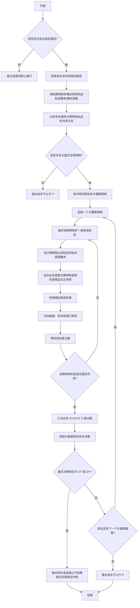
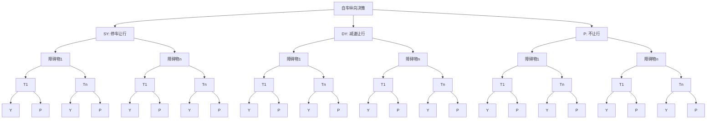

# 提案基本信息

## 背景技术

本提案应用于港口、园区、封闭道路等低速自动驾驶车辆的规划与控制系统，尤其适用于无人集卡、IMV、牵引车、乘用车等多车型混行场景中的纵向决策。纵向决策算法的作用是：在自车已经具有一条确定行驶路径的前提下，结合自车与障碍物的交互关系，决定自车沿该固定路径行驶时的纵向意图，即继续通行、减速让行或停车等待。

该类场景通常存在以下特点：

1. 自车与周围动态障碍物可能在路口、弯道、换道、直行跟车等场景中产生路径交汇，需要实时决定自车是通过还是让行。
2. 障碍物的预测轨迹具有多模态特征，例如同一车辆可能保持车道、左转、右转、换道或沿云控轨迹行驶，各模态的概率不同；这些轨迹反映了障碍物的横向意图和可能路径。
3. 港口车辆形态复杂，既包括单车，也包括带挂车的集卡或静态车体，需要同时考虑车头和挂车包络，普通点质点模型难以准确描述碰撞风险。
4. 预测模块通常只根据障碍物自身运动状态、地图和历史轨迹输出未来轨迹，并未显式考虑障碍物与自车之间的交互。例如，预测模块可以给出障碍物沿某条轨迹行驶的概率，但不能直接判断该障碍物在与自车冲突时会抢行还是让行。
5. 现有规则式纵向决策通常基于最近冲突点、TTC、距离阈值或优先级规则直接输出停车/通过结果，虽然实现简单，但难以同时处理障碍物多模态轨迹、自车与障碍物双向交互、停车死锁、历史决策连续性和低概率高风险事件。
6. 单纯基于学习模型或单一收益函数的方案，可能难以解释决策原因，也难以在安全敏感场景中保证对不同交互场景进行可验证的逐项评估。

因此，本提案要解决的技术问题是：在自车路径固定、障碍物预测轨迹多模态且预测未考虑自车交互的条件下，如何估计障碍物沿任意预测轨迹行驶时的纵向意图，并将自车停车让行、减速让行、不让行三类纵向决策与障碍物横向/纵向意图组合成可模拟的交互场景，最终选择分数最高的自车纵向决策。

## 本提案的基本思路

本提案提出一种基于障碍物纵向意图估计和多场景模拟的自动驾驶纵向决策方法。其核心思路可以概括为三步。

第一，明确纵向决策算法的作用边界。自车的横向路径由上游规划或引导线模块给出，纵向决策算法不重新生成自车路径，而是假设自车将沿该固定路径行驶。在此基础上，算法只决策自车的纵向动作：停车让行（Stop Yield，记为 SY）、减速让行（Decelerate Yield，记为 DY）或不让行（Pass，记为 P）。也就是说，本算法解决的是“沿已知路径如何与障碍物交互”的问题。

第二，对障碍物意图进行补全。预测模块给出障碍物的多模态轨迹 $T_1,T_2,\dots,T_n$，每条轨迹表达一种可能的横向意图，例如直行、转弯、换道或沿云控路径行驶，并带有对应概率。但该预测轨迹通常没有考虑与自车的交互，因此不能直接说明障碍物在冲突点处会让行自车还是不让行自车。为此，本提案提出基于规则的障碍物纵向意图估计器：针对障碍物的任意一条预测轨迹，结合障碍物速度、停车状态、冲突位置、遮挡关系、双方到达冲突点的相对时间等信息，估计障碍物让行自车（Yield，记为 Y）或不让行自车（Pass，记为 P）的概率。

第三，将自车决策和障碍物意图排列组合成场景树，并通过场景模拟选择最优自车决策。算法并不对所有障碍物进行全量组合，而是先通过关键障碍物筛选，仅保留与自车固定路径存在有效交互关系的障碍物，从源头减少后续决策规模。随后，系统按照关键障碍物与自车的冲突时距由近到远排序，依次构建和模拟场景树；若某一关键障碍物的最优结果已经要求自车停车让行或减速让行，则说明自车会在更近的冲突关系前采取让行策略，后续更远冲突关系的场景模拟可以跳过。对于当前关键障碍物，场景树首先展开自车三类纵向决策 SY、DY、P；再展开障碍物横向预测轨迹 $T_1,T_2,\dots,T_n$；最后在每条预测轨迹下展开障碍物纵向意图 Y 和 P。树中的每条根到叶路径对应一个候选交互场景，例如“自车 SY - 障碍物 1 - 轨迹 $T_1$ - 障碍物 Y”“自车 P - 障碍物 1 - 轨迹 $T_2$ - 障碍物 P”等。场景模拟器对每个叶子场景分别模拟自车和障碍物的未来运动，判断是否发生碰撞、是否双车停车、是否顺利通行，并根据安全性、通行效率、时间折扣和场景概率对该叶子场景打分。最后，系统按照自车纵向决策汇总场景树叶子节点的分数，在 SY、DY、P 中选取得分最高的自车决策作为输出。

通过上述方法，本提案将“预测模块未显式建模的交互意图”转化为“可估计概率、可枚举组合、可场景模拟、可量化评分”的纵向决策问题，并通过关键障碍物筛选和按冲突时距顺序提前终止的策略降低计算量，使自车在多模态预测和交互不确定性下仍能得到可解释且可验证的停车或通行决策。

## 本提案的详细描述

### 一、系统结构

本提案可以实现为自动驾驶 PNC 系统中的纵向决策模块，其主要组成如下：

各组成部分的功能如下：

1. 语义建模模块：将自车固定路径、自车状态、障碍物多模态预测轨迹和车辆几何信息统一表示为可用于交互推演的语义车辆集合。
2. 冲突关系分析模块：判断自车固定路径与障碍物各条预测轨迹是否存在空间冲突，并计算冲突点、停车缓冲点和车辆包络。
3. 关键障碍物及轨迹筛选模块：从所有障碍物中筛选与自车路径存在有效交互的关键障碍物，并保留其可能与自车发生交互的多模态轨迹，使后续决策只围绕关键障碍物展开，降低场景组合数量和计算开销。
4. 障碍物纵向意图估计器：在预测模块给出横向意图和轨迹的基础上，估计障碍物沿每条轨迹行驶时让行自车 Y 或不让行自车 P 的概率。
5. 交互场景树构建模块：将自车三类纵向决策 SY/DY/P、关键障碍物、障碍物横向轨迹 $T_1...T_n$ 和障碍物纵向意图 Y/P 逐层展开，形成包含多个叶子场景的交互场景树。
6. 场景模拟器：对每个候选交互场景，沿自车固定路径和障碍物预测轨迹模拟双方未来状态。
7. 场景评分模块：根据模拟结果计算每个场景的安全分、效率分和概率加权分。
8. 自车意图选择模块：汇总不同交互场景的分数，在 SY、DY、P 中选择分数最高的自车纵向决策，并输出停车点、减速让行结果或不让行结果。

### 二、算法实现细节

#### 1. 算法流程

#### 2. 关键实现步骤

##### 2.1 固定自车路径与纵向决策边界
本提案中的纵向决策算法以固定自车路径为前提。固定路径可以来自导航引导线、局部路径规划、换道路径或路口搜索路径。纵向决策算法不改变该路径的几何形状，也不重新选择横向路线，而是在该路径上决定自车未来的纵向决策。

设自车固定路径为 $\Gamma_e(s)$，其中 $s \in [0, L_e]$ 表示自车路径弧长坐标。纵向决策算法不改变 $\Gamma_e$，仅在如下自车纵向决策集合中选择：

$$
\mathcal{A}_e = \{\mathrm{SY}, \mathrm{DY}, \mathrm{P}\}
$$

自车纵向决策包括以下三类：

1. 停车让行 SY：自车在冲突点前按照安全缓冲距离停车，等待障碍物通过。
2. 减速让行 DY：自车不立即停车，而是通过减速扩大交互时间间隔，使障碍物先通过冲突区域。
3. 不让行 P：自车保持沿固定路径通行，不主动为该障碍物执行让行策略。

因此，该算法的输出不是一条新的路径，而是作用在固定路径上的纵向行为结果，包括 SY/DY/P 决策类别、停车位置或减速策略、相关冲突障碍物以及决策分数。

##### 2.2 障碍物横向意图与多模态轨迹输入

障碍物的轨迹和横向意图由预测模块给出。预测模块可以为同一个障碍物输出多条候选轨迹，每条轨迹对应一个横向意图或路径模态，例如直行、左转、右转、换道、保持车道、C2V 云控轨迹等，并附带该轨迹发生的概率。

对任一关键障碍物 $o_i$，预测模块输出 $K_i$ 条候选轨迹，可表示为：

$$
\mathcal{T}_i = \{(T_i^k, p_i^k) \mid k = 1,2,\dots,K_i\}, \quad \sum_{k=1}^{K_i} p_i^k = 1
$$

其中，$T_i^k$ 表示障碍物 $o_i$ 的第 $k$ 条预测轨迹，也即一种横向意图；$p_i^k$ 表示该轨迹发生的概率。

该预测结果解决的是“障碍物可能沿哪条路径运动”的问题，但并未充分解决“障碍物在与自车交互时会不会让行”的问题。也就是说，预测模块提供的是障碍物横向意图和轨迹概率，而不是障碍物让行自车 Y 或不让行自车 P 的纵向交互意图。

为了使该输入适用于纵向决策，系统将自车和障碍物统一转换为语义车辆对象：
系统在准备阶段读取当前规划帧，并仅在任务子状态为正常行驶时启用纵向语义转换。自车语义对象包括车辆类型、车辆参数、自车路径、地图限速、自车位置、速度、加速度、曲率、转向角以及挂车状态。若自车为集卡且挂车定位有效，则同时生成车头路径和挂车路径；否则按单车处理。

对于周围障碍物，系统根据预测轨迹类型和感知类型构建不同的语义车辆：

1. 若存在 C2V 轨迹，则优先使用 C2V 轨迹生成路径；当当前帧缺失 C2V 轨迹但历史语义集合中存在可匹配轨迹时，可通过历史路径匹配恢复路径连续性。
2. 对 IMV、普通车、集卡分别设置车辆子类型和几何参数，集卡同时处理车头障碍物与挂车障碍物，并生成挂车路径。
3. 对无有效预测轨迹或无法形成动态语义的障碍物，构建静态语义车辆，用于静态碰撞检测。
4. 对预测轨迹中的几何中心路径，转换为车辆后轴路径，以提高运动学仿真和碰撞检测的一致性。
5. 对每个横向预测模态保存路径、概率、横向行为类型和自车/障碍物包络。

##### 2.3 冲突关系分析与关键障碍物筛选
系统分别计算自车固定路径与障碍物各条预测轨迹之间的冲突关系。若某条障碍物轨迹与自车固定路径没有空间交叠，则该轨迹对纵向决策没有约束；若存在空间交叠，则记录其冲突点、冲突距离、碰撞包络和停车缓冲后的决策点。

冲突检测采用两级处理：

1. 粗筛阶段：将障碍物包络投影到自车固定路径的 SL 坐标，形成风险区域，快速排除横纵向范围外的目标。
2. 精检阶段：在风险区域附近沿路径采样车辆包络盒，检查车头和挂车包络是否重叠，得到最早冲突点、是否本体碰撞、冲突包络和未加缓冲的冲突距离。

随后，系统筛选关键障碍物。关键障碍物是指与自车固定路径存在有效交互关系、且交互距离处于决策范围内的障碍物。系统会剔除无交互障碍物、被更近冲突关系遮挡的障碍物、处于后方且不影响自车通行的障碍物，使后续纵向决策只针对关键障碍物构造场景树和执行场景模拟，从而避免对无关障碍物进行无效组合和评分。

筛选完成后，系统根据关键障碍物与自车的冲突时距由近到远排序。冲突时距可以由自车预计到达冲突点的时间、障碍物预计到达冲突点的时间以及二者时间差共同确定，用于表达冲突关系的先后和紧迫程度。后续决策算法按照该顺序逐个处理关键障碍物，优先模拟更近、更紧迫的冲突关系。

##### 2.4 基于规则的障碍物纵向意图估计器
在预测模块给出的任意一条障碍物轨迹上，本提案进一步估计障碍物的纵向意图，即障碍物沿该轨迹运动时，是倾向于让行自车 Y，还是倾向于不让行自车 P。
该估计器的输入包括：

1. 障碍物当前速度和是否停止。
2. 自车固定路径与障碍物轨迹之间的冲突点位置。
3. 自车到冲突点的距离和障碍物到冲突点的距离。
4. 自车与障碍物到达冲突点的相对时间。
5. 障碍物是否被其他冲突关系遮挡，或者是否存在本体碰撞风险。
6. 当前交互场景类型，例如车道保持、换道或路口转弯。

估计器输出障碍物让行自车概率 $P_{obs\_Y}$，并由此得到障碍物不让行自车概率 $P_{obs\_P}=1-P_{obs\_Y}$。其基本原则如下：

对于障碍物 $o_i$ 的第 $k$ 条预测轨迹，可将该估计过程表示为：

$$
q_i^k = P(a_o = \mathrm{Y} \mid T_i^k, \mathbf{x})
$$

$$
P(a_o = \mathrm{P} \mid T_i^k, \mathbf{x}) = 1 - q_i^k
$$

其中，$\mathbf{x}$ 表示用于规则估计的交互特征，包括障碍物速度、停车状态、冲突点位置、遮挡关系以及双方到达冲突点的相对时间等。

1. 障碍物速度越高，其不让行自车 P 的概率通常越高；速度与 P 概率之间可通过 Sigmoid 函数建立映射。
2. 障碍物已停止时，Y 概率提高，P 概率降低。
3. 障碍物轨迹与自车冲突位置过近或存在遮挡时，降低对障碍物纵向意图的确定性。
4. 当双方都可能到达同一冲突点时，比较自车和障碍物的预计到达时间；若障碍物更早到达，则提高 P 概率，若自车更早到达，则提高 Y 概率。
5. 不同场景采用不同修正规则。例如路口转弯场景更关注交叉冲突关系，车道保持场景更关注前后距离和跟随关系，换道场景更关注目标车道交互关系。

该估计器的意义在于：将预测模块未直接给出的交互信息补充为可计算的障碍物纵向意图概率，使后续决策可以同时考虑“障碍物走哪条轨迹”和“障碍物在该轨迹上是否让行”。

##### 2.5 自车意图与障碍物意图的场景树构建

对每个关键障碍物，系统针对其多条预测轨迹构造场景树。场景树由以下变量逐层展开：

1. 自车纵向决策：由本算法枚举，包括 SY、DY 和 P。
2. 关键障碍物：与自车固定路径存在有效交互关系的障碍物。
3. 障碍物横向意图：由预测模块给出的某条轨迹 $T_k$ 表示，并带有轨迹概率 $P_{lat}$。
4. 障碍物纵向意图：由规则估计器给出，包括障碍物让行自车 Y 和不让行自车 P，并带有概率 $P_{lon}$。

一种典型展开方式是：场景树根节点表示自车纵向决策；第一层分支表示 SY、DY、P；第二层分支表示关键障碍物；第三层分支表示障碍物横向意图，即障碍物可能选择的预测轨迹 $T_1,T_2,\dots,T_n$；第四层分支表示障碍物纵向意图 Y/P。对于任一障碍物轨迹，至少形成以下六类叶子场景：

1. 自车 SY，障碍物 Y。
2. 自车 SY，障碍物 P。
3. 自车 DY，障碍物 Y。
4. 自车 DY，障碍物 P。
5. 自车 P，障碍物 Y。
6. 自车 P，障碍物 P。

场景树中的每个叶子节点都有明确的路径、动作和概率。路径来自自车固定路径与障碍物预测轨迹；动作来自自车 SY/DY/P 决策和障碍物 Y/P 意图；概率来自障碍物轨迹概率和障碍物纵向意图概率。这样，原本连续且不确定的交互问题被转换为有限个可模拟、可评分的叶子场景集合。

场景树的一个叶子节点可表示为四元组：

$$
\ell = (i, k, a_e, a_o), \quad a_e \in \mathcal{A}_e,\ a_o \in \mathcal{A}_o
$$

其中，$i$ 表示关键障碍物编号，$k$ 表示该障碍物的预测轨迹编号，$\mathcal{A}_o = \{\mathrm{Y}, \mathrm{P}\}$ 表示障碍物纵向意图集合。$\mathrm{Y}$ 表示障碍物让行自车，$\mathrm{P}$ 表示障碍物不让行自车。该叶子节点的概率为：

$$
P(\ell) = p_i^k \cdot P(a_o \mid T_i^k, \mathbf{x})
$$

该表达清楚地表明：一个交互场景的概率由障碍物横向轨迹概率和障碍物纵向意图概率共同决定。一个典型的场景树展开示例如下：

##### 2.6 场景模拟器
场景模拟器用于评估每个候选交互场景的结果。模拟时，自车沿固定路径运动，障碍物沿其预测轨迹运动；若自车决策为 SY，则自车在冲突点前按安全缓冲距离停车；若自车决策为 DY，则自车通过减速扩大与障碍物的时间间隔；若自车决策为 P，则自车不主动让行并继续沿固定路径运动。障碍物纵向意图为 Y 时，表示障碍物让行自车；障碍物纵向意图为 P 时，表示障碍物不让行自车并沿预测轨迹通过冲突区域。

场景模拟过程按固定时间步长推进，持续到达到最大模拟时长、发生碰撞、双方停车或场景已经可以判定为止。每个模拟步更新以下内容：

1. 自车在固定路径上的位置、速度、加速度、航向和包络盒。
2. 障碍物在预测轨迹上的位置、速度、加速度、航向和包络盒。
3. 若车辆带挂车，则同时推算挂车状态和挂车包络盒。
4. 自车与障碍物包络是否重叠。
5. 双方是否均停止，以及停止时的车体间距。

场景模拟器的输出不是单一布尔值，而是场景演化结果，例如正常通行、碰撞、双车停车、安全通过或安全让行，并保留模拟轨迹和包络用于评分及解释。

##### 2.7 场景评分方法

对每个候选交互场景，系统根据场景模拟结果计算场景分数。分数至少包括安全分和效率分两部分：

1. 安全分：碰撞场景给予较大负分；双车停车场景根据停车距离给予安全收益或惩罚；正常通行场景根据自车与障碍物包络间距计算安全收益。
2. 效率分：自车保持通行且速度较高时得分较高；障碍物合理通行时也可计入周围车辆效率；双方都停车或无必要让行时得分较低。
3. 时间折扣：越靠近当前时刻的风险和收益权重越高，远期结果按时间折扣衰减。
4. 交通规则权重：直行、左转、右转、未知转向等不同横向行为可以采用不同效率权重，以表达场景优先级差异。
5. 历史一致性：若当前自车决策与上一帧决策一致，则给予一定连续性奖励，减少 SY、DY、P 之间的频繁抖动。

对每个叶子节点 $\ell$，场景模拟器输出安全分 $V_{safe}(\ell)$ 和效率分 $V_{eff}(\ell)$。候选交互场景的加权分数可概括为：

$$
V(\ell) = \left(\alpha_{safe} V_{safe}(\ell) + V_{eff}(\ell)\right) \cdot P(\ell)
$$

其中，$\alpha_{safe}$ 为安全风险系数，$P(\ell)$ 由障碍物横向轨迹概率和障碍物纵向意图概率共同决定，也可等价理解为 $P_{lat} \cdot P_{lon}$。若需要表达时间折扣，可进一步写为：

$$
V_{safe}(\ell), V_{eff}(\ell) = \sum_{t=0}^{T} \gamma^t r_t(\ell), \quad 0 < \gamma \le 1
$$

其中，$\gamma$ 为时间折扣因子，$r_t(\ell)$ 表示叶子场景 $\ell$ 在第 $t$ 个模拟步的安全或效率收益。

对于非 C2V 障碍物，还可以对安全分执行风险敏感重加权，使低概率高风险场景在总分中获得更高关注度。该机制可以避免单纯期望评分在危险小概率分支上过于激进。

##### 2.8 自车最优纵向意图选择

系统将所有候选交互场景按照自车纵向决策分组，分别累计 $\mathrm{SY}$、$\mathrm{DY}$、$\mathrm{P}$ 三类分数：

$$
J(a_e) = \sum_{\ell \in \mathcal{L}:\, \ell.a_e = a_e} V(\ell)
$$

$$
J(\mathrm{SY}) = \sum_{\ell \in \mathcal{L}:\, \ell.a_e = \mathrm{SY}} V(\ell)
$$

$$
J(\mathrm{DY}) = \sum_{\ell \in \mathcal{L}:\, \ell.a_e = \mathrm{DY}} V(\ell)
$$

$$
J(\mathrm{P}) = \sum_{\ell \in \mathcal{L}:\, \ell.a_e = \mathrm{P}} V(\ell)
$$

最终自车纵向意图由如下优化问题给出：

$$
a_e^* = \arg\max_{a_e \in \mathcal{A}_e} J(a_e)
$$

若 $J(\mathrm{SY})$ 最高，则系统输出停车让行并根据冲突点和停车缓冲距离输出停车位置；若 $J(\mathrm{DY})$ 最高，则系统输出减速让行；若 $J(\mathrm{P})$ 最高，则系统输出不让行。若存在多个关键障碍物，系统按冲突时距从近到远逐个评估，并在每个关键障碍物的场景树上执行上述三类决策评分。一旦某个关键障碍物对应的最优自车决策为 SY 或 DY，说明自车已需要在当前较近冲突关系前停车或减速让行，后续冲突时距更远的关键障碍物不再影响当前帧的最早让行决策，因此可以跳过后续场景模拟，直接输出当前让行结果。

输出给规划模块的信息包括：

1. 自车纵向决策：停车让行 SY、减速让行 DY 或不让行 P。
2. 若需要让行，输出停车决策点、冲突位置、车体碰撞包络和障碍物碰撞包络。
3. 输出 SY、DY、P 三类自车决策的分数，便于调试和可解释分析。
4. 输出关键车辆集合及其车辆类型。
5. 在路口低速场景下，根据速度、距离和本体碰撞关系，输出规划可忽略预测轨迹的障碍物集合，以降低无关预测对规划的干扰。

### 三、可保护的技术特征

1. 一种在自车路径固定的前提下，仅对自车纵向决策进行选择的方法，用于在停车让行 SY、减速让行 DY、不让行 P 三类动作中输出最优结果。
2. 一种将预测模块输出的障碍物多模态轨迹作为障碍物横向意图输入，并在此基础上补充估计障碍物纵向意图的方法。
3. 一种基于障碍物速度、停车状态、冲突点、遮挡关系和双方到达冲突点时间差的障碍物纵向意图概率估计器。
4. 一种基于“自车纵向决策 SY/DY/P、关键障碍物、障碍物横向轨迹 $T_1...T_n$、障碍物纵向意图 Y/P”逐层展开交互场景树的方法。
5. 一种对场景树的每个叶子场景执行双车场景模拟，并根据碰撞、双车停车、正常通行等结果进行评分的方法。
6. 一种将场景树叶子节点按自车 SY、DY、P 三类决策分组求和，并选择分数最高自车决策的纵向决策方法。
7. 一种同时支持车头与挂车包络的冲突检测和场景模拟方法，用于港口集卡等长车体自动驾驶场景。
8. 一种通过关键障碍物筛选使后续纵向决策仅处理关键障碍物，从而降低场景组合数量和计算开销的方法。
9. 一种按关键障碍物冲突时距排序并顺序执行场景模拟的方法，其中当较近冲突关系已经触发自车停车让行或减速让行时，跳过后续更远冲突关系的场景模拟，以进一步提高计算效率。
10. 一种融合场景概率、安全分、效率分、时间折扣、交通规则权重和历史一致性的交互场景评分方法。
11. 一种对低概率高风险候选场景进行风险敏感加权的纵向决策方法。

### 四、测试或实验数据建议

当前代码实现中已包含决策耗时日志、语义决策 JSON 保存、自车 SY/DY/P 决策分数输出、障碍物 Y/P 意图概率输出、冲突包络输出和 replayer 离线复现接口，可用于构造专利佐证材料。建议补充以下实验数据：

1. 路口交叉通行场景：比较本方法与固定 TTC/距离阈值方法在抢行、误停和双停次数上的差异。
2. 障碍物纵向意图估计实验：展示同一障碍物沿不同预测轨迹行驶时，规则估计器输出的 Y 概率和 P 概率变化。
3. 多模态预测场景：展示障碍物存在多个预测轨迹时，本方法如何组合自车 SY/DY/P、障碍物横向轨迹 $T_1...T_n$ 和障碍物 Y/P 纵向意图，并选择最终自车决策。
4. 场景模拟评分实验：展示不同候选交互场景的模拟结果、碰撞情况、停车情况、安全分和效率分。
5. 集卡挂车场景：展示仅考虑车头包络与同时考虑车头/挂车包络时，冲突点和停车点的差异。
6. 低概率高风险场景：展示风险敏感加权后，系统对危险预测分支的决策变化。
7. 连续帧稳定性实验：统计引入历史动作保持奖励前后的 SY/DY/P 决策抖动次数。
8. 实时性实验：统计语义转换和纵向决策模块在典型场景下的平均耗时、P95 耗时和最大耗时。

上述实验可以通过离线 rosbag/replayer 回放或实车日志复现方式完成，并将语义决策 JSON 中的障碍物轨迹概率、障碍物 Y/P 纵向意图概率、候选场景分数、模拟结果、最终自车 SY/DY/P 分数和停车冲突点作为证据材料。